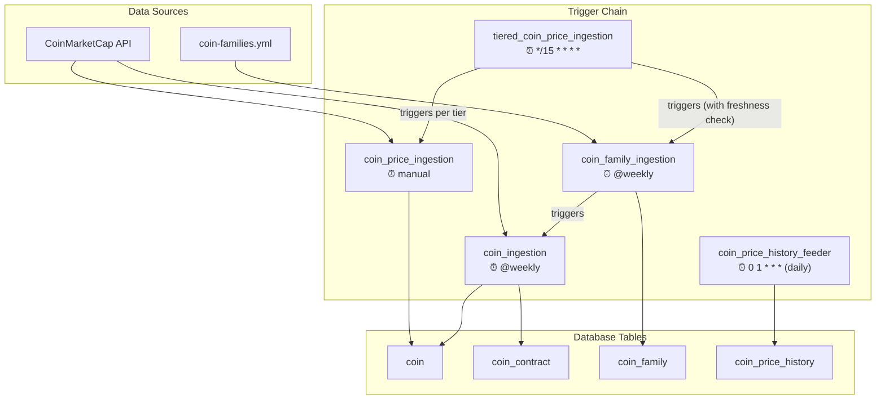
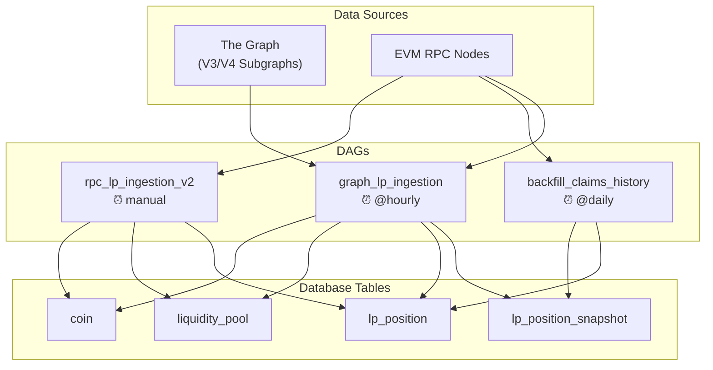
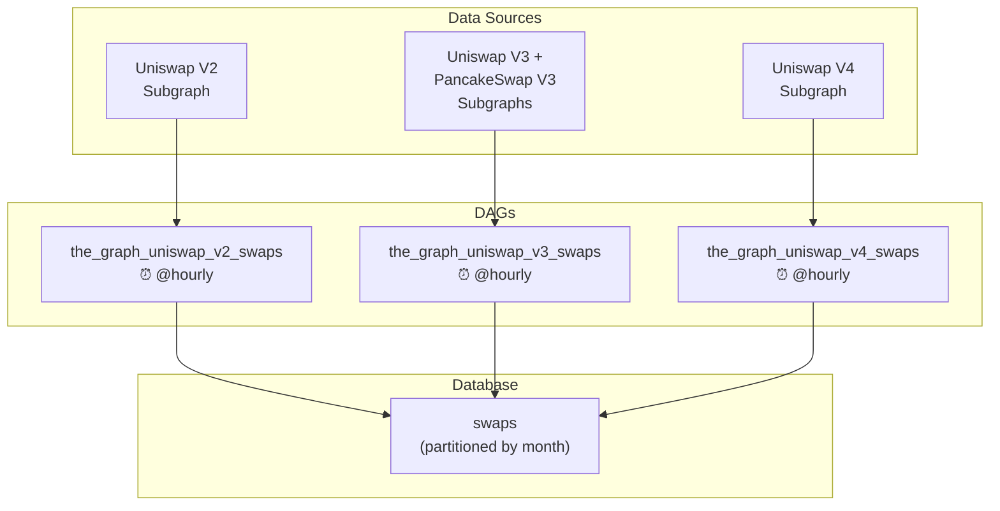
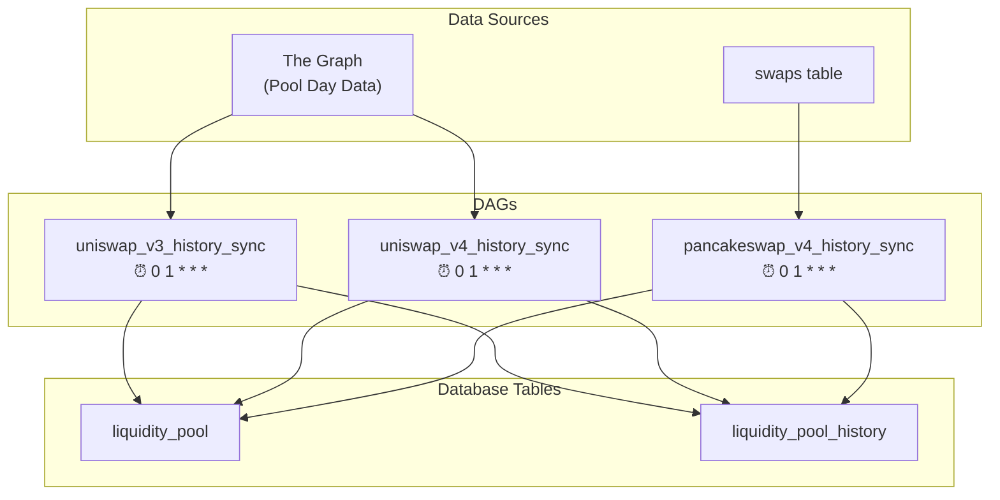
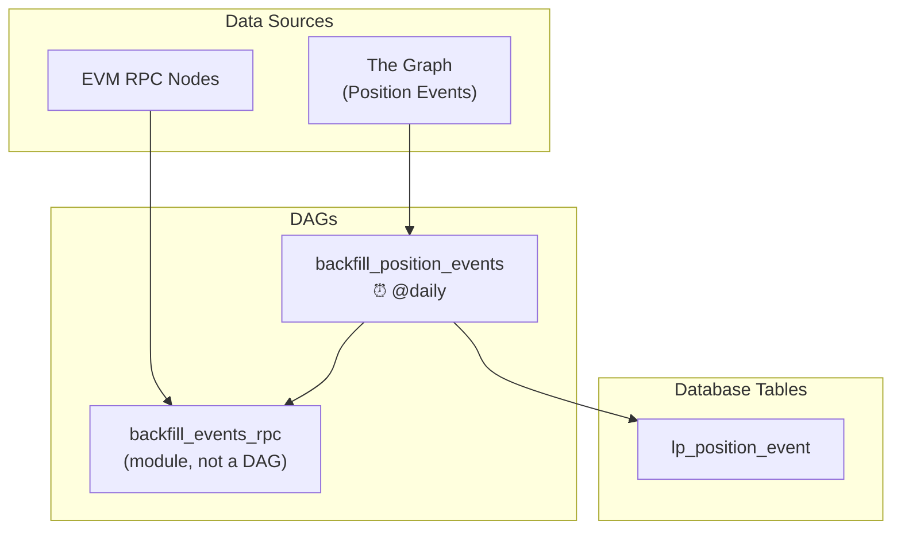
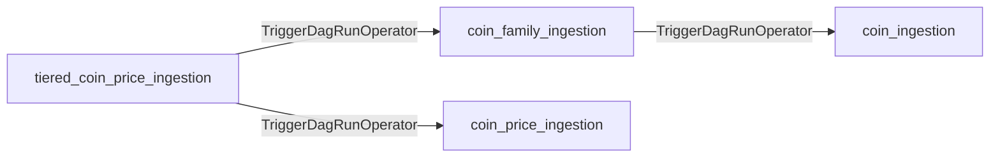

# Chain-Feeder ETL Pipeline Architecture

This document provides a complete map of every ETL pipeline (Airflow DAG), its external data sources, the database tables it feeds, and how the pipelines connect to each other.

## System Overview

`   ``mermaid
graph LR
    subgraph External["External Data Sources"]
        CMC["CoinMarketCap API"]
        GRF["The Graph<br/>Subgraphs"]
        RPC["EVM RPC Nodes<br/>(Eth, Arb, Base)"]
        YAML["coin-families.yml<br/>(Config File)"]
    end

    subgraph Pipelines["Airflow DAG Pipelines"]
        direction TB
        COIN["🪙 Coin<br/>Pipeline"]
        LP["📊 LP Position<br/>Pipeline"]
        SWAP["🔄 Swap<br/>Pipeline"]
        HIST["📈 History<br/>Pipeline"]
        EVENT["⚡ Event<br/>Pipeline"]
    end

    subgraph DB["PostgreSQL (chaintelligence)"]
        CT[("coin<br/>coin_contract<br/>coin_family")]
        CPH[("coin_price_history")]
        LPT[("liquidity_pool")]
        POS[("lp_position<br/>lp_position_snapshot")]
        SW[("swaps")]
        LPH[("lp_history")]
        EVT[("lp_position_event")]
    end

    CMC --> COIN
    YAML --> COIN
    COIN --> CT
    COIN --> CPH

    GRF --> LP
    RPC --> LP
    LP --> CT
    LP --> LPT
    LP --> POS

    GRF --> SWAP
    SWAP --> SW

    GRF --> HIST
    SW -.-> HIST
    HIST --> LPT
    HIST --> LPH

    RPC --> EVENT
    EVENT --> POS
    EVENT --> EVT
```

---

## Pipeline Groups

### 1. Coin Pipeline — Metadata, Prices, Families

These DAGs maintain the `coin`, `coin_contract`, `coin_family`, and `coin_price_history` tables.



| DAG | File | Schedule | Source | Tables Written |
|---|---|---|---|---|
| `tiered_coin_price_ingestion` | [tiered_coin_price_ingestion.py](file:///Users/szabi/git/chaintelligence/chain-feeder/dags/tiered_coin_price_ingestion.py) | `*/15 * * * *` | — (orchestrator) | — |
| `coin_price_ingestion` | [coin_price_ingestion.py](file:///Users/szabi/git/chaintelligence/chain-feeder/dags/coin_price_ingestion.py) | manual | CoinMarketCap | `coin` |
| `coin_family_ingestion` | [coin_family_ingestion.py](file:///Users/szabi/git/chaintelligence/chain-feeder/dags/coin_family_ingestion.py) | `@weekly` | `coin-families.yml` | `coin_family` |
| `coin_ingestion` | [coin_ingestion.py](file:///Users/szabi/git/chaintelligence/chain-feeder/dags/coin_ingestion.py) | `@weekly` | CoinMarketCap `/cryptocurrency/map` | `coin`, `coin_contract` |
| `coin_price_history_feeder` | [coin_price_history_feeder.py](file:///Users/szabi/git/chaintelligence/chain-feeder/dags/coin_price_history_feeder.py) | `0 1 * * *` | CoinMarketCap | `coin_price_history` |

**Flow detail:**

1. **`tiered_coin_price_ingestion`** is the primary scheduled orchestrator. Every 15 minutes it:
   - Triggers `coin_family_ingestion` to sync families from YAML.
   - Checks 3 tiers of coins for price staleness (T1 = active LP coins, T2 = top 200, T3 = rank 200–500).
   - Triggers `coin_price_ingestion` for each stale tier.

2. **`coin_family_ingestion`** watches `coin-families.yml` for changes, then triggers `coin_ingestion` (CMC mapping sync), then updates the `coin_family` table from YAML.

3. **`coin_ingestion`** fetches the CoinMarketCap `/cryptocurrency/map` endpoint, resolves coin metadata (name, slug, rank, contract addresses), and upserts to `coin` and `coin_contract`.

4. **`coin_price_ingestion`** resolves target symbols/addresses/families to CMC IDs, fetches quotes, and updates `coin.price`, `coin.price_timestamp`, percent changes, market cap, TVL, etc.

5. **`coin_price_history_feeder`** snapshots current coin prices to `coin_price_history` daily. Used for historical price analysis and APR calculations.

---

### 2. LP Position Pipeline — Discovery, Snapshots, Ranges, Claims

These DAGs discover LP positions, create snapshots, backfill tick ranges, and scan for fee claims.



| DAG | File | Schedule | Source | Tables Written |
|---|---|---|---|---|
| `graph_lp_ingestion` | [graph_lp_ingestion.py](file:///Users/szabi/git/chaintelligence/chain-feeder/dags/graph_lp_ingestion.py) | `@hourly` | The Graph subgraphs + RPC (range backfill) | `coin`, `liquidity_pool`, `liquidity_pool_position`, `liquidity_pool_position_snapshot` |
| `rpc_lp_ingestion_v2` | [rpc_lp_ingestion_v2.py](file:///Users/szabi/git/chaintelligence/chain-feeder/dags/rpc_lp_ingestion_v2.py) | manual | EVM RPC (NFT transfer logs) | `coin`, `liquidity_pool`, `liquidity_pool_position`, `liquidity_pool_position_event` |
| `backfill_claims_history` | [backfill_claims_dag.py](file:///Users/szabi/git/chaintelligence/chain-feeder/dags/backfill_claims_dag.py) | `@daily` | EVM RPC (Collect/ModifyLiquidity logs) | `liquidity_pool_position_snapshot`, `liquidity_pool_position` |

**Flow detail:**

1. **`graph_lp_ingestion`** is the primary position discovery pipeline:
   - Calls The Graph V3/V4 subgraphs to discover positions for `TARGET_ADDRESS` wallets.
   - Upserts coins, pools, positions, and creates time-series snapshots.
   - Backfills tick ranges (tick_lower, tick_upper, current_tick) via Graph or RPC.

   - Fetches positions from Zapper API, ingests coins/pools/positions/snapshots.
   - Contains shared tasks: `update_prices`, `fetch_missing_ranges` (Graph/RPC), `update_claims_batch` (RPC claim scan).
   - Scheduled for removal — see [Zapper Deprecation PRD](file:///Users/szabi/git/chaintelligence/docs/features/zapper-deprecation-prd.md).

3. **`rpc_lp_ingestion_v2`** is the on-chain fallback discovery:
   - Scans NFT Transfer events on Uniswap V3/V4 NonfungiblePositionManager.
   - Enriches positions with on-chain details (token IDs, tick data).
   - Currently Ethereum-only; Arbitrum and Base are prepared but disabled.


---

### 3. Swap Pipeline — Trade Event Ingestion

These DAGs fetch swap (trade) events from The Graph subgraphs and write to a single **unified `swaps` table** (partitioned by month). The legacy per-protocol tables (`uniswap_v2_swaps`, `uniswap_v3_swaps`, `uniswap_v4_swaps`) still exist in the schema but are no longer written to.



| DAG | File | Schedule | Source | Tables Written | Networks |
|---|---|---|---|---|---|
| `the_graph_uniswap_v2_swaps` | [the_graph_uniswap_v2_swaps.py](file:///Users/szabi/git/chaintelligence/chain-feeder/dags/the_graph_uniswap_v2_swaps.py) | `@hourly` | Uniswap V2 subgraph | `swaps` | Ethereum |
| `the_graph_uniswap_v3_swaps` | [the_graph_uniswap_v3_swaps.py](file:///Users/szabi/git/chaintelligence/chain-feeder/dags/the_graph_uniswap_v3_swaps.py) | `@hourly` | Uniswap V3 + PancakeSwap V3 subgraphs | `swaps` | Ethereum, Arbitrum, Base, BNB |
| `the_graph_uniswap_v4_swaps` | [the_graph_uniswap_v4_swaps.py](file:///Users/szabi/git/chaintelligence/chain-feeder/dags/the_graph_uniswap_v4_swaps.py) | `@hourly` | Uniswap V4 subgraph | `swaps` | Ethereum |

**Flow detail:**

All three swap DAGs follow the same pattern:
1. Fetch swap events from The Graph subgraphs for tracked token pairs.
2. Resolve token symbols to `coin_id` foreign keys.
3. Insert to the unified `swaps` table (PK: `ts, tx_hash, log_index`). Rows are distinguished by `protocol` and `network` columns.
4. Used by the History Pipeline for volume/TVL aggregation and by the API for route/trade analysis.

The `swaps` table uses monthly range partitioning on the `ts` column (e.g. `swaps_2026_07`). Schema defined in [create_swaps_table.sql](file:///Users/szabi/git/chaintelligence/chain-feeder/include/sql/create_swaps_table.sql).

Shared utilities live in [common/utils/uniswap_utils.py](file:///Users/szabi/git/chaintelligence/chain-feeder/dags/common/utils/uniswap_utils.py) (`UniswapV3Fetcher`, `UniswapV4Fetcher`, `PostgresStorage`, etc.).

---

### 4. History Pipeline — Daily Pool Metrics Aggregation

These DAGs produce daily aggregated metrics (volume, TVL, tx count) per pool.



| DAG | File | Schedule | Source | Tables Written | Networks |
|---|---|---|---|---|---|
| `uniswap_v3_history_sync` | [uniswap_v3_history_sync.py](file:///Users/szabi/git/chaintelligence/chain-feeder/dags/uniswap_v3_history_sync.py) | `0 1 * * *` | The Graph (V3 pool day data) | `liquidity_pool`, `liquidity_pool_history` | Ethereum, Arbitrum, Base |
| `uniswap_v4_history_sync` | [uniswap_v4_history_sync.py](file:///Users/szabi/git/chaintelligence/chain-feeder/dags/uniswap_v4_history_sync.py) | `0 1 * * *` | The Graph (V4 pool day data) | `liquidity_pool`, `liquidity_pool_history` | Ethereum |
| `pancakeswap_v4_history_sync` | [pancakeswap_v4_history_sync.py](file:///Users/szabi/git/chaintelligence/chain-feeder/dags/pancakeswap_v4_history_sync.py) | `0 1 * * *` | Swap tables (derived) + The Graph (pool IDs) | `liquidity_pool`, `liquidity_pool_history` | BNB |

**Flow detail:**

1. **V3 and V4 history syncs** query The Graph for `poolDayData` entities, auto-create missing pool entries in `liquidity_pool`, then upsert daily metrics into `liquidity_pool_history`.
2. **PancakeSwap V4 history sync** reads from the `swaps` table (populated by `the_graph_uniswap_v3_swaps` which also fetches PCS V3 swaps) and aggregates swap volume into daily history. It also queries The Graph to backfill `pool_id` (V4 poolId) on `liquidity_pool`.

---

### 5. Event Pipeline — Position Lifecycle Events

These DAGs scan on-chain events to track position lifecycle (mints, burns, fee collections).



| DAG | File | Schedule | Source | Tables Written |
|---|---|---|---|---|
| `backfill_position_events` | [backfill_events_dag.py](file:///Users/szabi/git/chaintelligence/chain-feeder/dags/backfill_events_dag.py) | `@daily` | `backfill_position_events.py` script (RPC) | `liquidity_pool_position_event` |
| `backfill_events_rpc` (module) | [backfill_events_rpc.py](file:///Users/szabi/git/chaintelligence/chain-feeder/dags/backfill_events_rpc.py) | — (library) | EVM RPC (IncreaseLiquidity, DecreaseLiquidity, Collect) | `liquidity_pool_position_event` |

**Flow detail:**

- `backfill_position_events` runs daily, invoking the `backfill_position_events.py` script which scans RPC logs for V3/V4 liquidity modification events.
- `backfill_events_rpc.py` is a standalone module (not an Airflow DAG itself) containing the RPC log scanning logic for position events.

---

### 6. Utility DAGs — Manual Operations

| DAG | File | Schedule | Purpose | Tables Written |
|---|---|---|---|---|
| `manual_pool_sync` | [manual_pool_sync.py](file:///Users/szabi/git/chaintelligence/chain-feeder/dags/manual_pool_sync.py) | — (script) | Creates `liquidity_pool` entries from swap data | `liquidity_pool` |
| `manual_tvl_sync` | [manual_tvl_sync.py](file:///Users/szabi/git/chaintelligence/chain-feeder/dags/manual_tvl_sync.py) | — (script) | Fetches TVL from The Graph and updates pool history | `liquidity_pool_history` |
| `sync_empty_pools_tvl` | [sync_empty_pools_tvl.py](file:///Users/szabi/git/chaintelligence/chain-feeder/dags/sync_empty_pools_tvl.py) | — (script) | Fills TVL for pools that have history entries with zero TVL | `liquidity_pool_history` |
| `rpc_lp_ingestion` (v1) | [rpc_lp_ingestion.py](file:///Users/szabi/git/chaintelligence/chain-feeder/dags/rpc_lp_ingestion.py) | manual | Legacy V1 RPC position discovery | `liquidity_pool_position` |

---

## Complete Database Schema Map

Shows which tables are **written** by which pipeline groups and **read** by which consumers.

| Table | Writers (DAGs) | Readers |
|---|---|---|
| `coin_contract` | coin_ingestion | backfill_claims_rpc, backfill_events_rpc |
| `coin_family` | coin_family_ingestion | tiered_coin_price_ingestion, coin_price_history_feeder |
| `coin_price_history` | coin_price_history_feeder | API (APR calculations) |
| `liquidity_pool_history` | uniswap_v3_history_sync, uniswap_v4_history_sync, pancakeswap_v4_history_sync, manual_tvl_sync | API (pool analytics) |
| `liquidity_pool_position_event` | backfill_position_events, rpc_lp_ingestion_v2 | API (event timeline) |
| `swaps` | the_graph_uniswap_v2_swaps, the_graph_uniswap_v3_swaps, the_graph_uniswap_v4_swaps | History sync, manual_pool_sync, API |
| `v_lp_snapshots_summary` | — (view) | API (`/api/lp/position-summary`) |

---

## Schedule Summary

| DAG | Schedule | Frequency | Pipeline |
|---|---|---|---|
| `tiered_coin_price_ingestion` | `*/15 * * * *` | 15 min | Coin |
| `coin_price_ingestion` | manual (triggered) | — | Coin |
| `coin_family_ingestion` | `@weekly` (+ triggered) | weekly | Coin |
| `coin_ingestion` | `@weekly` (+ triggered) | weekly | Coin |
| `coin_price_history_feeder` | `0 1 * * *` | daily 1 AM | Coin |
| `graph_lp_ingestion` | `@hourly` | hourly | LP |
| `backfill_claims_history` | `@daily` | daily | LP |
| `rpc_lp_ingestion_v2` | manual | — | LP |
| `the_graph_uniswap_v2_swaps` | `@hourly` | hourly | Swap |
| `the_graph_uniswap_v3_swaps` | `@hourly` | hourly | Swap |
| `the_graph_uniswap_v4_swaps` | `@hourly` | hourly | Swap |
| `uniswap_v3_history_sync` | `0 1 * * *` | daily 1 AM | History |
| `uniswap_v4_history_sync` | `0 1 * * *` | daily 1 AM | History |
| `pancakeswap_v4_history_sync` | `0 1 * * *` | daily 1 AM | History |
| `backfill_position_events` | `@daily` | daily | Event |

---

## Naming Convention (July 2026)

All DAGs follow: `<source>_<chain>_<protocol>_<version>_<output_table>_<fields>`

| Source | Values |
|--------|--------|
| `graph` | The Graph subgraph |
| `rpc` | EVM RPC node |
| `cmc` | CoinMarketCap API |
| `defillama` | DeFi Llama API |
| `yaml` | Static YAML config |

### Complete DAG List (25 total)

**Coin Pipeline (5):**
- `cmc_global_coin_tiered_price` — orchestrator (triggers `yaml_global_coin_family`, `cmc_global_coin_price`)
- `cmc_global_coin_metadata` — writes `coin`, `coin_contract`
- `cmc_global_coin_price` — updates `coin.price`
- `yaml_global_coin_family` — writes `coin_family`
- `defillama_global_coin_price_history` — writes `coin_price_history`

**Swap Pipeline (11):**
- `graph_ethereum_uniswap_v2_swaps` — writes `swaps`
- `graph_ethereum_uniswap_v3_swaps` — writes `swaps`
- `graph_arbitrum_uniswap_v3_swaps` — writes `swaps`
- `graph_base_uniswap_v3_swaps` — writes `swaps`
- `graph_base_aerodrome_v3_swaps` — writes `swaps`
- `graph_bnb_uniswap_v3_swaps` — writes `swaps` (protocol='Uniswap V3')
- `graph_bnb_pancakeswap_v3_swaps` — writes `swaps` (protocol='PancakeSwap V3')
- `graph_ethereum_uniswap_v4_swaps` — writes `swaps`
- `graph_arbitrum_uniswap_v4_swaps` — writes `swaps`
- `graph_base_uniswap_v4_swaps` — writes `swaps`
- `graph_bnb_pancakeswap_v4_swaps` — writes `swaps`

**History Pipeline (5):**
- `graph_ethereum_uniswap_v3_liquidity_pool_history` — writes `liquidity_pool`, `liquidity_pool_history`
- `graph_arbitrum_uniswap_v3_liquidity_pool_history` — writes `liquidity_pool`, `liquidity_pool_history`
- `graph_base_uniswap_v3_liquidity_pool_history` — writes `liquidity_pool`, `liquidity_pool_history`
- `graph_ethereum_uniswap_v4_liquidity_pool_history` — writes `liquidity_pool`, `liquidity_pool_history`
- `graph_bnb_pancakeswap_v4_liquidity_pool_history` — writes `liquidity_pool`, `liquidity_pool_history`

**LP Pipeline (4):**
- `graph_all_uniswap_v3_liquidity_pool_position_snapshot` — writes `coin`, `liquidity_pool`, `liquidity_pool_position`, `liquidity_pool_position_snapshot`
- `rpc_ethereum_uniswap_v3_liquidity_pool_position` — writes `liquidity_pool_position`
- `rpc_all_uniswap_v3_liquidity_pool_position_snapshot_claims` — writes `liquidity_pool_position_snapshot`, `liquidity_pool_position`
- `rpc_all_uniswap_v3_liquidity_pool_position_event` — writes `liquidity_pool_position_event`

All using `schedule='@hourly'` (swap/LP discovery) or `'0 1 * * *'` (history) or `'*/15 * * * *'` (coin prices). All set `catchup=False`.

## Cross-DAG Dependencies



> [!WARNING]

---

## Environment Variables

| Variable | Used By | Purpose |
|---|---|---|
| `CMC_API_KEY` | coin_ingestion, coin_price_ingestion | CoinMarketCap API authentication |
| `GRAPH_API_KEY` | graph_lp_ingestion, swap DAGs, history DAGs | The Graph Gateway API key |
| `RPC_URL` | backfill_claims_rpc, backfill_events_rpc, rpc_lp_ingestion_v2 | Primary Ethereum RPC endpoint |
| `DATA_WAREHOUSE_DB` | backfill_claims_rpc, backfill_events_rpc, manual scripts | Direct psycopg2 connection string |

---

## Shared Code Modules

| Module | Location | Used By |
|---|---|---|
| `uniswap_utils.py` | [common/utils/uniswap_utils.py](file:///Users/szabi/git/chaintelligence/chain-feeder/dags/common/utils/uniswap_utils.py) | V2/V3/V4 swap DAGs, manual_tvl_sync, sync_empty_pools_tvl |
| `graph_ingestion_helpers.py` | [include/graph_ingestion_helpers.py](file:///Users/szabi/git/chaintelligence/chain-feeder/include/graph_ingestion_helpers.py) | graph_lp_ingestion |
| `graph_discovery_client.py` | [include/graph_discovery_client.py](file:///Users/szabi/git/chaintelligence/chain-feeder/include/graph_discovery_client.py) | graph_lp_ingestion |
| `rpc_discovery_engine.py` | [include/rpc_discovery_engine.py](file:///Users/szabi/git/chaintelligence/chain-feeder/include/rpc_discovery_engine.py) | rpc_lp_ingestion, rpc_lp_ingestion_v2 |
| `coinmarketcap_client.py` | [include/coinmarketcap_client.py](file:///Users/szabi/git/chaintelligence/chain-feeder/include/coinmarketcap_client.py) | coin_price_ingestion |
| `coin_family_resolver.py` | [include/coin_family_resolver.py](file:///Users/szabi/git/chaintelligence/chain-feeder/include/coin_family_resolver.py) | coin_family_ingestion, coin_price_history_feeder |
