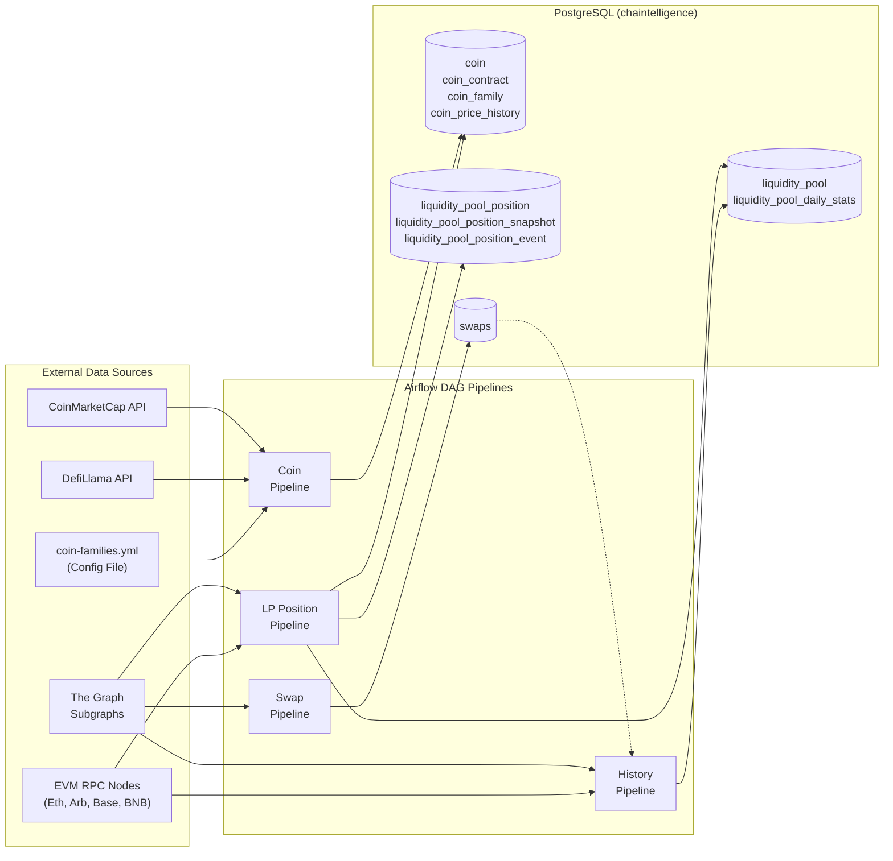
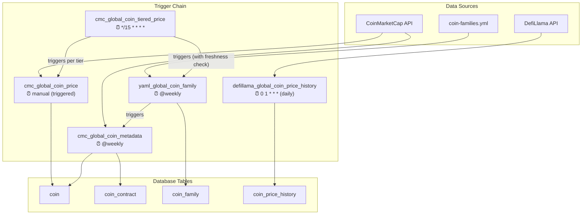
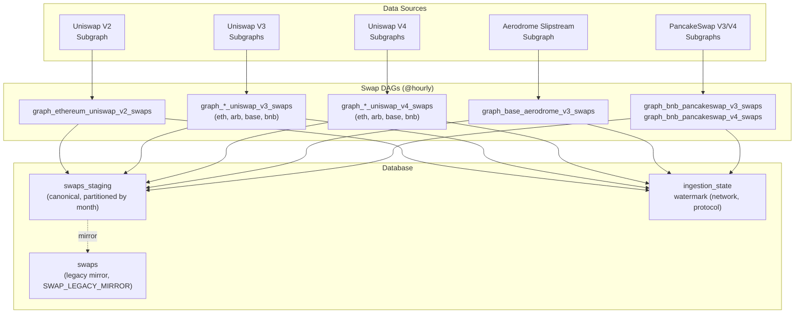
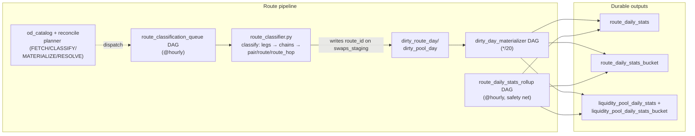
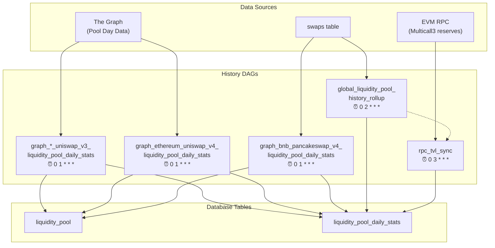
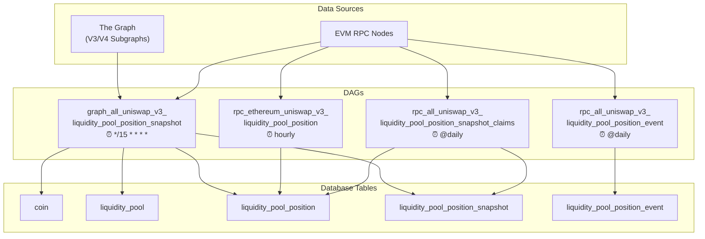
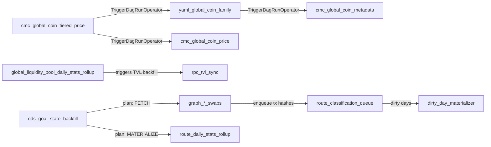

# Chain-Feeder ETL Pipeline Architecture

This document provides a complete map of every ETL pipeline (Airflow DAG), its external data sources, the database tables it feeds, and how the pipelines connect to each other.

## System Overview


```mermaid
graph LR
    subgraph External["External Data Sources"]
        CMC["CoinMarketCap API"]
        DL["DefiLlama API"]
        GRF["The Graph<br/>Subgraphs"]
        RPC["EVM RPC Nodes<br/>(Eth, Arb, Base, BNB)"]
        YAML["coin-families.yml<br/>(Config File)"]
    end

    subgraph Pipelines["Airflow DAG Pipelines"]
        direction TB
        COIN["Coin<br/>Pipeline"]
        LP["LP Position<br/>Pipeline"]
        SWAP["Swap<br/>Pipeline"]
        HIST["History<br/>Pipeline"]
    end

    subgraph DB["PostgreSQL (chaintelligence)"]
        CT[("coin<br/>coin_contract<br/>coin_family<br/>coin_price_history")]
        LPT[("liquidity_pool<br/>liquidity_pool_daily_stats")]
        POS[("liquidity_pool_position<br/>liquidity_pool_position_snapshot<br/>liquidity_pool_position_event")]
        SW[("swaps")]
    end

    CMC --> COIN
    DL --> COIN
    YAML --> COIN
    COIN --> CT

    GRF --> LP
    RPC --> LP
    LP --> CT
    LP --> LPT
    LP --> POS

    GRF --> SWAP
    SWAP --> SW

    GRF --> HIST
    SW -.-> HIST
    RPC --> HIST
    HIST --> LPT
```

---

## Naming Convention

All DAGs follow: `<source>_<chain>_<protocol>_<version>_<output>_<fields>`

| Source | Values |
|--------|--------|
| `graph` | The Graph subgraph |
| `rpc` | EVM RPC node |
| `cmc` | CoinMarketCap API |
| `defillama` | DeFi Llama API |
| `yaml` | Static YAML config |

`<chain>` is `global` when the DAG spans all chains, or a specific network (`ethereum`, `arbitrum`, `base`, `bnb`). All DAGs set `catchup=False`.

---

## Pipeline Groups

### 1. Coin Pipeline — Metadata, Prices, Families

These DAGs maintain the `coin`, `coin_contract`, `coin_family`, and `coin_price_history` tables.


```mermaid
graph TD
    subgraph Triggers["Trigger Chain"]
        TIERED["cmc_global_coin_tiered_price<br/>⏰ */15 * * * *"]
        FAMILY["yaml_global_coin_family<br/>⏰ @weekly"]
        META["cmc_global_coin_metadata<br/>⏰ @weekly"]
        PRICE["cmc_global_coin_price<br/>⏰ manual (triggered)"]
        CPHF["defillama_global_coin_price_history<br/>⏰ 0 1 * * * (daily)"]
    end

    TIERED -- "triggers (with freshness check)" --> FAMILY
    TIERED -- "triggers per tier" --> PRICE
    FAMILY -- "triggers" --> META

    subgraph Sources["Data Sources"]
        CMC["CoinMarketCap API"]
        DL["DefiLlama API"]
        YAML["coin-families.yml"]
    end

    CMC --> META
    CMC --> PRICE
    DL --> CPHF
    YAML --> FAMILY

    subgraph Tables["Database Tables"]
        COIN_T["coin"]
        CC_T["coin_contract"]
        CF_T["coin_family"]
        CPH_T["coin_price_history"]
    end

    META --> COIN_T
    META --> CC_T
    FAMILY --> CF_T
    PRICE --> COIN_T
    CPHF --> CPH_T
```

| DAG | File | Schedule | Source | Tables Written |
|---|---|---|---|---|
| `cmc_global_coin_tiered_price` | [cmc_global_coin_tiered_price.py](file:///Users/szabi/git/chaintelligence/chain-feeder/dags/cmc_global_coin_tiered_price.py) | `*/15 * * * *` | — (orchestrator) | — |
| `cmc_global_coin_metadata` | [cmc_global_coin_metadata.py](file:///Users/szabi/git/chaintelligence/chain-feeder/dags/cmc_global_coin_metadata.py) | `@weekly` | CoinMarketCap (multi-source waterfall) | `coin`, `coin_contract` |
| `cmc_global_coin_price` | [cmc_global_coin_price.py](file:///Users/szabi/git/chaintelligence/chain-feeder/dags/cmc_global_coin_price.py) | `None` (triggered) | CoinMarketCap | `coin` |
| `yaml_global_coin_family` | [yaml_global_coin_family.py](file:///Users/szabi/git/chaintelligence/chain-feeder/dags/yaml_global_coin_family.py) | `@weekly` | `coin-families.yml` | `coin_family` |
| `defillama_global_coin_price_history` | [defillama_global_coin_price_history.py](file:///Users/szabi/git/chaintelligence/chain-feeder/dags/defillama_global_coin_price_history.py) | `0 1 * * *` | DefiLlama | `coin_price_history` |

**Flow detail:**

1. **`cmc_global_coin_tiered_price`** is the primary scheduled orchestrator. Every 15 minutes it:
   - Triggers `yaml_global_coin_family` to sync families from YAML.
   - Checks 3 tiers of coins for price staleness (T1 = active LP coins, T2 = top 200, T3 = rank 200–500).
   - Triggers `cmc_global_coin_price` for each stale tier.

2. **`yaml_global_coin_family`** watches `coin-families.yml` for changes, then triggers `cmc_global_coin_metadata` (CMC mapping sync), then updates the `coin_family` table from YAML.

3. **`cmc_global_coin_metadata`** fetches the CoinMarketCap `/cryptocurrency/map` endpoint, resolves coin metadata (name, slug, rank, contract addresses), and upserts to `coin` and `coin_contract`.

4. **`cmc_global_coin_price`** resolves target symbols/addresses/families to CMC IDs, fetches quotes, and updates `coin.price`, `coin.price_timestamp`, percent changes, market cap, TVL, etc.

5. **`defillama_global_coin_price_history`** snapshots current coin prices to `coin_price_history` daily. Used for historical price analysis and APR calculations.

#### Multi-Source Contract Address Ingestion & Conflict Resolution

The `cmc_global_coin_metadata` DAG uses `MultiSourceContractEngine` ([contract_ingestion.py](file:///Users/szabi/git/chaintelligence/chain-feeder/include/contract_ingestion.py)) to discover and resolve smart contract addresses across multiple API providers.

##### Ingestion Waterfall
1. **Tier 1 (Manual Config):** Hardcoded overrides in `coin-families.yml` (`confidence_score: 100`).
2. **Tier 2 (CoinMarketCap API):** `cmc_map_fetch` & `cmc_info_fetch` tasks (`confidence_score: 90`).
3. **Tier 3 (On-Chain Swap Logs / Subgraphs):** Extracted on-the-fly from DEX swap events (`confidence_score: 85`).
4. **Tier 4 (CoinGecko API):** Query platform contract mappings for tokens unmapped by CMC (`confidence_score: 80`).
5. **Tier 5 (DexScreener API):** Query search API for DEX-native and newly launched tokens, filtering by pool liquidity ($ > $1,000) to reject scam/impostor tokens (`confidence_score: 70`).

##### Conflict Resolution Rule
When candidate contract addresses conflict or multiple sources return data for the same `(coin_id, chain_id)`:
```sql
INSERT INTO coin_contract (coin_id, chain_id, contract_address, decimals, is_native, source, confidence_score, verified_at, tracked)
VALUES (%s, %s, %s, %s, %s, %s, %s, NOW(), true)
ON CONFLICT (coin_id, chain_id) DO UPDATE SET
    contract_address = EXCLUDED.contract_address,
    decimals = COALESCE(EXCLUDED.decimals, coin_contract.decimals),
    is_native = EXCLUDED.is_native,
    source = EXCLUDED.source,
    confidence_score = EXCLUDED.confidence_score,
    verified_at = EXCLUDED.verified_at
WHERE EXCLUDED.confidence_score >= coin_contract.confidence_score;
```
- A lower-priority source (e.g. DexScreener score 70) **cannot overwrite** an address registered by a higher-priority source (e.g. CMC score 90).
- If a contract address is bound to another `coin_id` on the same chain (`idx_coin_contract_addr` unique index), it is updated only if the new incoming source has a higher confidence score.

---

### 2. Swap Pipeline — Trade Event Ingestion

These DAGs fetch swap (trade) events from The Graph subgraphs. The **canonical** short-lived raw store is `swaps_staging` (monthly range-partitioned on `ts`). The legacy `swaps` table is written only as a **compatibility mirror** while `SWAP_LEGACY_MIRROR=true` (default), so legacy API raw-swap fallbacks keep working during the switchover; once they are migrated, flip it to `false` and retire `swaps`.

Every committed batch is followed by **asynchronous route classification**: the distinct transaction hashes are enqueued into `route_classification_queue`, drained by the `route_classification_queue` DAG (see §3).


```mermaid
graph TD
    subgraph Sources["Data Sources"]
        V2_SUB["Uniswap V2<br/>Subgraph"]
        V3_SUB["Uniswap V3<br/>Subgraphs"]
        V4_SUB["Uniswap V4<br/>Subgraphs"]
        AERO_SUB["Aerodrome Slipstream<br/>Subgraph"]
        PCS_SUB["PancakeSwap V3/V4<br/>Subgraphs"]
    end

    subgraph DAGs["Swap DAGs (@hourly)"]
        V2["graph_ethereum_uniswap_v2_swaps"]
        V3["graph_*_uniswap_v3_swaps<br/>(eth, arb, base, bnb)"]
        V4["graph_*_uniswap_v4_swaps<br/>(eth, arb, base, bnb)"]
        AERO["graph_base_aerodrome_v3_swaps"]
        PCS["graph_bnb_pancakeswap_v3_swaps<br/>graph_bnb_pancakeswap_v4_swaps"]
    end

    V2_SUB --> V2
    V3_SUB --> V3
    V4_SUB --> V4
    AERO_SUB --> AERO
    PCS_SUB --> PCS

    subgraph Tables["Database"]
        STAGING["swaps_staging<br/>(canonical, partitioned by month)"]
        SWAPS["swaps<br/>(legacy mirror, SWAP_LEGACY_MIRROR)"]
        IQ["ingestion_state<br/>watermark (network, protocol)"]
    end

    V2 --> STAGING
    V3 --> STAGING
    V4 --> STAGING
    AERO --> STAGING
    PCS --> STAGING
    STAGING -.->|"mirror"| SWAPS
    V2 --> IQ
    V3 --> IQ
    V4 --> IQ
    AERO --> IQ
    PCS --> IQ
```

| DAG | File | Schedule | Source | Networks |
|---|---|---|---|---|
| `graph_ethereum_uniswap_v2_swaps` | [graph_ethereum_uniswap_v2_swaps.py](file:///Users/szabi/git/chaintelligence/chain-feeder/dags/graph_ethereum_uniswap_v2_swaps.py) | `@hourly` | Uniswap V2 subgraph | Ethereum |
| `graph_ethereum_uniswap_v3_swaps` | [graph_ethereum_uniswap_v3_swaps.py](file:///Users/szabi/git/chaintelligence/chain-feeder/dags/graph_ethereum_uniswap_v3_swaps.py) | `@hourly` | Uniswap V3 subgraph | Ethereum |
| `graph_arbitrum_uniswap_v3_swaps` | [graph_arbitrum_uniswap_v3_swaps.py](file:///Users/szabi/git/chaintelligence/chain-feeder/dags/graph_arbitrum_uniswap_v3_swaps.py) | `@hourly` | Uniswap V3 subgraph | Arbitrum |
| `graph_base_uniswap_v3_swaps` | [graph_base_uniswap_v3_swaps.py](file:///Users/szabi/git/chaintelligence/chain-feeder/dags/graph_base_uniswap_v3_swaps.py) | `@hourly` | Uniswap V3 subgraph | Base |
| `graph_base_aerodrome_v3_swaps` | [graph_base_aerodrome_v3_swaps.py](file:///Users/szabi/git/chaintelligence/chain-feeder/dags/graph_base_aerodrome_v3_swaps.py) | `@hourly` | Aerodrome Slipstream subgraph | Base (protocol='Aerodrome') |
| `graph_bnb_uniswap_v3_swaps` | [graph_bnb_uniswap_v3_swaps.py](file:///Users/szabi/git/chaintelligence/chain-feeder/dags/graph_bnb_uniswap_v3_swaps.py) | `@hourly` | Uniswap V3 subgraph | BNB |
| `graph_bnb_pancakeswap_v3_swaps` | [graph_bnb_pancakeswap_v3_swaps.py](file:///Users/szabi/git/chaintelligence/chain-feeder/dags/graph_bnb_pancakeswap_v3_swaps.py) | `@hourly` | PancakeSwap V3 subgraph | BNB |
| `graph_ethereum_uniswap_v4_swaps` | [graph_ethereum_uniswap_v4_swaps.py](file:///Users/szabi/git/chaintelligence/chain-feeder/dags/graph_ethereum_uniswap_v4_swaps.py) | `@hourly` | Uniswap V4 subgraph | Ethereum |
| `graph_arbitrum_uniswap_v4_swaps` | [graph_arbitrum_uniswap_v4_swaps.py](file:///Users/szabi/git/chaintelligence/chain-feeder/dags/graph_arbitrum_uniswap_v4_swaps.py) | `@hourly` | Uniswap V4 subgraph | Arbitrum |
| `graph_base_uniswap_v4_swaps` | [graph_base_uniswap_v4_swaps.py](file:///Users/szabi/git/chaintelligence/chain-feeder/dags/graph_base_uniswap_v4_swaps.py) | `@hourly` | Uniswap V4 subgraph | Base |
| `graph_bnb_uniswap_v4_swaps` | [graph_bnb_uniswap_v4_swaps.py](file:///Users/szabi/git/chaintelligence/chain-feeder/dags/graph_bnb_uniswap_v4_swaps.py) | `@hourly` | Uniswap V4 subgraph | BNB |
| `graph_bnb_pancakeswap_v4_swaps` | [graph_bnb_pancakeswap_v4_swaps.py](file:///Users/szabi/git/chaintelligence/chain-feeder/dags/graph_bnb_pancakeswap_v4_swaps.py) | `@hourly` | PancakeSwap V4 subgraph | BNB |

**Flow detail:**

All swap DAGs follow the same pattern:
1. Fetch swap events from The Graph subgraphs for tracked token pairs, checkpointing against `ingestion_state.last_ts` per (network, protocol).
2. Validate per-swap tokens/pool and resolve `pool_id` via `PostgresStorage.save_swaps`.
3. Insert to the canonical `swaps_staging` table (PK: `ts, tx_hash, log_index`); mirror rows to `swaps` while `SWAP_LEGACY_MIRROR=true`. Rows are distinguished by `network` and `protocol` columns.
4. Advance the `ingestion_state` watermark.
5. Enqueue the committed batch's distinct tx hashes into `route_classification_queue` for async route classification (§3).

The `swaps_staging` table uses monthly range partitioning on `ts` (e.g. `swaps_staging_2026_08`). Schema defined in [create_swaps_staging.sql](file:///Users/szabi/git/chaintelligence/chain-feeder/include/sql/create_swaps_staging.sql). Raw rows are short-lived: they are pruned after their route/pool aggregates exist (see `purge_aggregated_swaps` and the O&D goal-state retention in §6).

Shared utilities live in [common/utils/uniswap_utils.py](file:///Users/szabi/git/chaintelligence/chain-feeder/dags/common/utils/uniswap_utils.py) (`UniswapV3Fetcher`, `UniswapV4Fetcher`, `PostgresStorage`, etc.).

---

### 3. Route Classification & Materialization

This pipeline turns short-lived raw swap legs into the durable route taxonomy and daily aggregates, and materializes LP daily/bucket facts. It is **decoupled** from ingestion (route reconstruction never blocks Graph callbacks).


```mermaid
graph LR
    subgraph Stages["Route pipeline"]
        Q["route_classification_queue DAG<br/>(@hourly)"]
        CL["route_classifier.py<br/>classify: legs → chains →<br/>pair/route/route_hop"]
        DIRTY["dirty_route_day/<br/>dirty_pool_day"]
        MAT["dirty_day_materializer DAG<br/>(*/20)"]
        ROLL["route_daily_stats_rollup DAG<br/>(@hourly, safety net)"]
        PL["od_catalog + reconcile<br/>planner (FETCH/CLASSIFY/<br/>MATERIALIZE/RESOLVE)"]
    end
    subgraph Tables2["Durable outputs"]
        RD["route_daily_stats"]
        RB["route_daily_stats_bucket"]
        PB["liquidity_pool_daily_stats +<br/>liquidity_pool_daily_stats_bucket"]
    end

    Q --> CL
    CL -->|"writes route_id on swaps_staging"| DIRTY
    DIRTY --> MAT --> RD
    MAT --> RB
    MAT --> PB
    ROLL --> RD
    ROLL --> RB
    ROLL --> PB
    PL -.->|"dispatch"| Q
```

| DAG | Schedule | Role | Tables Written |
|---|---|---|---|
| `route_classification_queue` | `@hourly` | Drains `route_classification_queue`, classifies tx hashes (set-based / parallel-capable), records fine-grained `dirty_route_day` / `dirty_pool_day`. Holds the route-write advisory lock only during the short SQL merge. | `swaps_staging.route_id` (update), `origin_destination_pair`, `route`, `route_hop`, `dirty_route_day`, `dirty_pool_day` |
| `dirty_day_materializer` | `*/20 * * * *` | Consumes `dirty_route_day` / `dirty_pool_day`, recomputes **exactly** those days (route daily stats + route + pool buckets) incrementally. Backlog-guarded by `max_days_per_run` (default 90). | `route_daily_stats`, `route_daily_stats_bucket`, `liquidity_pool_daily_stats_bucket` |
| `route_daily_stats_rollup` | `@hourly` | **Safety net**: recomputes a rolling recent window (default 3 days) of `route_daily_stats`, `route_daily_stats_bucket`, `liquidity_pool_daily_stats_bucket`. | same as above |
| `global_liquidity_pool_daily_stats_rollup` | `0 2 * * *` (daily) | Rolls up `liquidity_pool_daily_stats` volume/count from `swaps_staging` (+ zero-fills, TVL fallback). | `liquidity_pool_daily_stats` |

The control plane (§6) drives the plumbing: `od_catalog.py` compiles `config/ods-goal-state.yaml` into O&D sets + requested products, and `reconcile.py` decides, per (set, product, chain, day), whether work is `FETCH` (raw missing), `CLASSIFY` (raw present, unclassified), `MATERIALIZE` (facts missing), or `RESOLVE` (satisfied).

---

### 4. History Pipeline — Daily Pool Metrics Aggregation

These DAGs produce daily aggregated metrics (volume, TVL, tx count) per pool and write to `liquidity_pool_daily_stats` (auto-creating pool entries in `liquidity_pool` when needed).


```mermaid
graph TD
    subgraph Sources["Data Sources"]
        GRAPH_H["The Graph<br/>(Pool Day Data)"]
        SWAPS_T["swaps table"]
        RPC_TVL["EVM RPC<br/>(Multicall3 reserves)"]
    end

    subgraph DAGs["History DAGs"]
        V3H["graph_*_uniswap_v3_<br/>liquidity_pool_daily_stats<br/>⏰ 0 1 * * *"]
        V4H["graph_ethereum_uniswap_v4_<br/>liquidity_pool_daily_stats<br/>⏰ 0 1 * * *"]
        PCS["graph_bnb_pancakeswap_v4_<br/>liquidity_pool_daily_stats<br/>⏰ 0 1 * * *"]
        ROLLUP["global_liquidity_pool_<br/>history_rollup<br/>⏰ 0 2 * * *"]
        TVL["rpc_tvl_sync<br/>⏰ 0 3 * * *"]
    end

    GRAPH_H --> V3H
    GRAPH_H --> V4H
    SWAPS_T --> ROLLUP
    SWAPS_T --> PCS
    RPC_TVL --> TVL
    ROLLUP -.-> TVL

    subgraph Tables["Database Tables"]
        LP_T["liquidity_pool"]
        LPH_T["liquidity_pool_daily_stats"]
    end

    V3H --> LP_T
    V3H --> LPH_T
    V4H --> LP_T
    V4H --> LPH_T
    PCS --> LP_T
    PCS --> LPH_T
    ROLLUP --> LPH_T
    TVL --> LPH_T
```

| DAG | File | Schedule | Source | Tables Written | Networks |
|---|---|---|---|---|---|
| `graph_ethereum_uniswap_v3_liquidity_pool_daily_stats` | [graph_ethereum_uniswap_v3_liquidity_pool_daily_stats.py](file:///Users/szabi/git/chaintelligence/chain-feeder/dags/graph_ethereum_uniswap_v3_liquidity_pool_daily_stats.py) | `0 1 * * *` | The Graph (V3 pool day data) | `liquidity_pool`, `liquidity_pool_daily_stats` | Ethereum |
| `graph_arbitrum_uniswap_v3_liquidity_pool_daily_stats` | [graph_arbitrum_uniswap_v3_liquidity_pool_daily_stats.py](file:///Users/szabi/git/chaintelligence/chain-feeder/dags/graph_arbitrum_uniswap_v3_liquidity_pool_daily_stats.py) | `0 1 * * *` | The Graph (V3 pool day data) | `liquidity_pool`, `liquidity_pool_daily_stats` | Arbitrum |
| `graph_base_uniswap_v3_liquidity_pool_daily_stats` | [graph_base_uniswap_v3_liquidity_pool_daily_stats.py](file:///Users/szabi/git/chaintelligence/chain-feeder/dags/graph_base_uniswap_v3_liquidity_pool_daily_stats.py) | `0 1 * * *` | The Graph (V3 pool day data) | `liquidity_pool`, `liquidity_pool_daily_stats` | Base |
| `graph_ethereum_uniswap_v4_liquidity_pool_daily_stats` | [graph_ethereum_uniswap_v4_liquidity_pool_daily_stats.py](file:///Users/szabi/git/chaintelligence/chain-feeder/dags/graph_ethereum_uniswap_v4_liquidity_pool_daily_stats.py) | `0 1 * * *` | The Graph (V4 pool day data) | `liquidity_pool`, `liquidity_pool_daily_stats` | Ethereum |
| `graph_bnb_pancakeswap_v4_liquidity_pool_daily_stats` | [graph_bnb_pancakeswap_v4_liquidity_pool_daily_stats.py](file:///Users/szabi/git/chaintelligence/chain-feeder/dags/graph_bnb_pancakeswap_v4_liquidity_pool_daily_stats.py) | `0 1 * * *` | Swap tables (derived) + The Graph (pool IDs) | `liquidity_pool`, `liquidity_pool_daily_stats` | BNB |
| `global_liquidity_pool_daily_stats_rollup` | [global_liquidity_pool_daily_stats_rollup.py](file:///Users/szabi/git/chaintelligence/chain-feeder/dags/global_liquidity_pool_daily_stats_rollup.py) | `0 2 * * *` | `swaps` (derived) | `liquidity_pool_daily_stats` | all |
| `rpc_tvl_sync` | [rpc_tvl_sync.py](file:///Users/szabi/git/chaintelligence/chain-feeder/dags/rpc_tvl_sync.py) | `0 3 * * *` | EVM RPC (Multicall3 reserves) | `liquidity_pool_daily_stats` | all |

**Flow detail:**

1. **Per-network history syncs** query The Graph for `poolDayData` entities, auto-create missing pool entries in `liquidity_pool`, then upsert daily metrics into `liquidity_pool_daily_stats`.
2. **`global_liquidity_pool_daily_stats_rollup`** aggregates tx_count and USD volume from the `swaps` table into `liquidity_pool_daily_stats` for all pools, zero-fills dormant pools, and triggers the TVL-fallback backfill (`rpc_tvl_sync`). Runs daily at 2 AM.
3. **`rpc_tvl_sync`** reads on-chain reserves via Multicall3 / `eth_getStorageAt` (bypassing The Graph, which reports 0 TVL for stablecoin pools), computes USD TVL, and upserts into `liquidity_pool_daily_stats`. Runs daily at 3 AM, forward-fills 90 days.

---

### 5. LP Position Pipeline — Discovery, Snapshots, Events, Claims

These DAGs discover LP positions, create snapshots, scan for fee claims, and track position lifecycle events.


```mermaid
graph TD
    subgraph Sources["Data Sources"]
        GRAPH["The Graph<br/>(V3/V4 Subgraphs)"]
        RPC_N["EVM RPC Nodes"]
    end

    subgraph DAGs["DAGs"]
        SNAP["graph_all_uniswap_v3_<br/>liquidity_pool_position_snapshot<br/>⏰ */15 * * * *"]
        RPC_LP["rpc_ethereum_uniswap_v3_<br/>liquidity_pool_position<br/>⏰ hourly"]
        CLAIMS["rpc_all_uniswap_v3_<br/>liquidity_pool_position_snapshot_claims<br/>⏰ @daily"]
        EVENTS["rpc_all_uniswap_v3_<br/>liquidity_pool_position_event<br/>⏰ @daily"]
    end

    GRAPH --> SNAP
    RPC_N --> SNAP
    RPC_N --> RPC_LP
    RPC_N --> CLAIMS
    RPC_N --> EVENTS

    subgraph Tables["Database Tables"]
        COIN["coin"]
        POOL["liquidity_pool"]
        POS["liquidity_pool_position"]
        SNAP_T["liquidity_pool_position_snapshot"]
        EVT_T["liquidity_pool_position_event"]
    end

    SNAP --> COIN
    SNAP --> POOL
    SNAP --> POS
    SNAP --> SNAP_T
    RPC_LP --> POS
    CLAIMS --> SNAP_T
    CLAIMS --> POS
    EVENTS --> EVT_T
```

| DAG | File | Schedule | Source | Tables Written |
|---|---|---|---|---|
| `graph_all_uniswap_v3_liquidity_pool_position_snapshot` | [graph_all_uniswap_v3_liquidity_pool_position_snapshot.py](file:///Users/szabi/git/chaintelligence/chain-feeder/dags/graph_all_uniswap_v3_liquidity_pool_position_snapshot.py) | `*/15 * * * *` | The Graph V3/V4 subgraphs + RPC (range backfill) | `coin`, `liquidity_pool`, `liquidity_pool_position`, `liquidity_pool_position_snapshot` |
| `rpc_ethereum_uniswap_v3_liquidity_pool_position` | [rpc_ethereum_uniswap_v3_liquidity_pool_position.py](file:///Users/szabi/git/chaintelligence/chain-feeder/dags/rpc_ethereum_uniswap_v3_liquidity_pool_position.py) | `timedelta(hours=1)` | EVM RPC (NFT Transfer logs) | `liquidity_pool_position` |
| `rpc_all_uniswap_v3_liquidity_pool_position_snapshot_claims` | [rpc_all_uniswap_v3_liquidity_pool_position_snapshot_claims.py](file:///Users/szabi/git/chaintelligence/chain-feeder/dags/rpc_all_uniswap_v3_liquidity_pool_position_snapshot_claims.py) | `@daily` | EVM RPC (Collect/ModifyLiquidity logs) | `liquidity_pool_position_snapshot`, `liquidity_pool_position` |
| `rpc_all_uniswap_v3_liquidity_pool_position_event` | [rpc_all_uniswap_v3_liquidity_pool_position_event.py](file:///Users/szabi/git/chaintelligence/chain-feeder/dags/rpc_all_uniswap_v3_liquidity_pool_position_event.py) | `@daily` | EVM RPC (IncreaseLiquidity, DecreaseLiquidity, Collect) | `liquidity_pool_position_event` |

**Flow detail:**

1. **`graph_all_uniswap_v3_liquidity_pool_position_snapshot`** is the primary position discovery pipeline:
   - Calls The Graph V3/V4 subgraphs to discover positions for `TARGET_ADDRESS` wallets across all chains.
   - Upserts coins, pools, positions, and creates time-series snapshots.
   - Backfills tick ranges (tick_lower, tick_upper, current_tick) via Graph or RPC.

2. **`rpc_ethereum_uniswap_v3_liquidity_pool_position`** is the on-chain fallback discovery:
   - Scans NFT Transfer events on the Uniswap V3/V4 NonfungiblePositionManager.
   - Enriches positions with on-chain details (token IDs, tick data).
   - Currently Ethereum-only; Arbitrum and Base are prepared but disabled.

3. **`rpc_all_uniswap_v3_liquidity_pool_position_snapshot_claims`** scans RPC logs for `Collect` and `ModifyLiquidity` events daily, backfilling claimable/claimed fees onto snapshots and positions.

4. **`rpc_all_uniswap_v3_liquidity_pool_position_event`** scans RPC logs for the full position lifecycle (IncreaseLiquidity, DecreaseLiquidity, Collect) and writes `liquidity_pool_position_event`.

---

### 6. Utility DAGs

| DAG | File | Schedule | Purpose | Tables Written |
|---|---|---|---|---|
| `ods_goal_state_retention` | [ods_goal_state_retention.py](file:///Users/szabi/git/chaintelligence/chain-feeder/dags/ods_goal_state_retention.py) | `0 3 * * *` | Evaluates `config/ods-goal-state.yaml` requirements against the warehouse, reports coverage + gaps, and (when `dry_run=false`) prunes rows outside the effective keep-windows. Replaces `config_global_swap_retention`. | `swaps`/`swaps_staging` (deletions), `route_daily_stats` (delete+recompute), `route_daily_stats_bucket`, `liquidity_pool_*` (deletions) |
| `ods_goal_state_backfill` | [ods_goal_state_backfill.py](file:///Users/szabi/git/chaintelligence/chain-feeder/dags/ods_goal_state_backfill.py) | `*/30 * * * *` | **Planner-driven reconciler**: compiles the catalog (`od_catalog.py`), reads the coverage ledger (`reconcile.py`), and dispatches `FETCH`→per-chain swap ETL DAGs (`graph_*_swaps` with a `backfill_days` conf) and `MATERIALIZE`→rollup DAGs. Raw-present/unclassified yields `CLASSIFY` (handled by the classifier), **never** a Graph re-fetch — so it stops querying The Graph once requirements are met. Params: `backfill_days_cap` (90). | none directly |
| `route_classification_queue` | [route_classification_queue.py](file:///Users/szabi/git/chaintelligence/chain-feeder/dags/route_classification_queue.py) | `@hourly` | Async route classification worker (see §3); records dirty days for the materializer. | `swaps_staging.route_id`, `origin_destination_pair`, `route`, `route_hop`, `dirty_route_day`, `dirty_pool_day` |
| `dirty_day_materializer` | [dirty_day_materializer.py](file:///Users/szabi/git/chaintelligence/chain-feeder/dags/dirty_day_materializer.py) | `*/20 * * * *` | Incremental fact materializer over dirty days (see §3). | `route_daily_stats`, `route_daily_stats_bucket`, `liquidity_pool_daily_stats_bucket` |
| `purge_aggregated_swaps` | [purge_aggregated_swaps.py](file:///Users/szabi/git/chaintelligence/chain-feeder/dags/purge_aggregated_swaps.py) | (opt-in) | Purges `swaps_staging` rows once their route/pool aggregates exist; drops empty historical partitions. Feature-flag `RAW_SWAP_PURGE_ENABLED`. | `swaps_staging` (deletions) |
| `config_global_swap_retention` | [config_global_swap_retention.py](file:///Users/szabi/git/chaintelligence/chain-feeder/dags/config_global_swap_retention.py) | `0 3 * * *` | **Superseded** by `ods_goal_state_retention` (paused on creation; kept for manual/emergency use). Reads `config/swap-retention.yaml` and deletes `swaps` rows older than the configured retention period per (network, protocol) in batches. | `swaps` (deletions) |

---

## Complete Database Schema Map

Shows which tables are **written** by which pipeline groups and **read** by which consumers.

| Table | Writers (DAGs) | Readers |
|---|---|---|
| `coin` | `cmc_global_coin_metadata`, `cmc_global_coin_price`, `graph_all_uniswap_v3_liquidity_pool_position_snapshot` | API (token registry) |
| `coin_contract` | `cmc_global_coin_metadata` | RPC claim/event scan, API |
| `coin_family` | `yaml_global_coin_family` | `cmc_global_coin_tiered_price`, `defillama_global_coin_price_history` |
| `coin_price_history` | `defillama_global_coin_price_history` | API (APR calculations) |
| `liquidity_pool` | history DAGs, `graph_all_uniswap_v3_liquidity_pool_position_snapshot` | API (pool analytics), swap DAGs (pool_id FK) |
| `liquidity_pool_daily_stats` | history DAGs, `global_liquidity_pool_daily_stats_rollup`, `rpc_tvl_sync` | API (pool analytics) |
| `liquidity_pool_position` | `graph_all_uniswap_v3_liquidity_pool_position_snapshot`, `rpc_ethereum_uniswap_v3_liquidity_pool_position`, `rpc_all_uniswap_v3_liquidity_pool_position_snapshot_claims` | API (`/api/lp/position-summary`) |
| `liquidity_pool_position_snapshot` | `graph_all_uniswap_v3_liquidity_pool_position_snapshot`, `rpc_all_uniswap_v3_liquidity_pool_position_snapshot_claims` | `v_lp_snapshots_summary` view |
| `liquidity_pool_position_event` | `rpc_all_uniswap_v3_liquidity_pool_position_event` | API (event timeline) |
| `swaps` | swap DAGs (legacy mirror), `route_classification_queue` | API raw-swap fallbacks, `config_global_swap_retention` (legacy) |
| `swaps_staging` | all swap DAGs (canonical raw store), `route_classification_queue` (sets `route_id`) | `route_daily_stats` rollup, `global_liquidity_pool_daily_stats_rollup`, `purge_aggregated_swaps`, API route analysis |
| `ingestion_state` | all swap DAGs | swap DAGs (watermark cursor) |
| `origin_destination_pair` | `route_classification_queue` | route classification, API O&D sets |
| `route` | `route_classification_queue` | API route analysis, `route_daily_stats` FK |
| `route_hop` | `route_classification_queue` | pool-resolution, API |
| `route_daily_stats` | `dirty_day_materializer`, `route_daily_stats_rollup`, `ods_goal_state_retention` (recompute) | API (`/api/routes/analyze`, postgres_fetcher) |
| `route_daily_stats_bucket` | `dirty_day_materializer`, `route_daily_stats_rollup` | API route distribution |
| `liquidity_pool_daily_stats_bucket` | `dirty_day_materializer`, `route_daily_stats_rollup` | API pool distribution |
| `dirty_route_day` / `dirty_pool_day` | `route_classification_queue` | `dirty_day_materializer` |
| `od_set_*`, `source_day_coverage`, `classification_day_coverage`, `product_day_coverage`, `od_set_pool_daily_stats` | control plane (`ods_goal_state_backfill`, `ods_lp_set_materializer`) | `ods_reconcile`/`ods_goal_state_backfill` planner, API `/api/ods/goal-state` |
| `v_lp_snapshots_summary` | — (view) | API (`/api/lp/position-summary`) |

---

## Schedule Summary

| DAG | Schedule | Frequency | Pipeline |
|---|---|---|---|
| `cmc_global_coin_tiered_price` | `*/15 * * * *` | 15 min | Coin |
| `cmc_global_coin_metadata` | `@weekly` | weekly | Coin |
| `cmc_global_coin_price` | `None` (triggered) | — | Coin |
| `yaml_global_coin_family` | `@weekly` | weekly | Coin |
| `defillama_global_coin_price_history` | `0 1 * * *` | daily 1 AM | Coin |
| `graph_*_uniswap_v3_swaps` | `@hourly` | hourly | Swap |
| `graph_*_uniswap_v4_swaps` | `@hourly` | hourly | Swap |
| `graph_ethereum_uniswap_v2_swaps` | `@hourly` | hourly | Swap |
| `graph_base_aerodrome_v3_swaps` | `@hourly` | hourly | Swap |
| `graph_bnb_pancakeswap_v3_swaps` | `@hourly` | hourly | Swap |
| `graph_bnb_pancakeswap_v4_swaps` | `@hourly` | hourly | Swap |
| `graph_*_uniswap_v3_liquidity_pool_daily_stats` | `0 1 * * *` | daily 1 AM | History |
| `graph_ethereum_uniswap_v4_liquidity_pool_daily_stats` | `0 1 * * *` | daily 1 AM | History |
| `graph_bnb_pancakeswap_v4_liquidity_pool_daily_stats` | `0 1 * * *` | daily 1 AM | History |
| `global_liquidity_pool_daily_stats_rollup` | `0 2 * * *` | daily 2 AM | History |
| `rpc_tvl_sync` | `0 3 * * *` | daily 3 AM | History |
| `graph_all_uniswap_v3_liquidity_pool_position_snapshot` | `*/15 * * * *` | 15 min | LP |
| `rpc_ethereum_uniswap_v3_liquidity_pool_position` | `timedelta(hours=1)` | hourly | LP |
| `rpc_all_uniswap_v3_liquidity_pool_position_snapshot_claims` | `@daily` | daily | LP |
| `rpc_all_uniswap_v3_liquidity_pool_position_event` | `@daily` | daily | LP |
| `config_global_swap_retention` | `0 3 * * *` | daily 3 AM | Utility (superseded — paused) |
| `ods_goal_state_retention` | `0 3 * * *` | daily 3 AM | Utility |
| `ods_goal_state_backfill` | `*/30 * * * *` | 30 min | Utility |
| `route_classification_queue` | `@hourly` | hourly | Route |
| `dirty_day_materializer` | `*/20 * * * *` | 20 min | Route |
| `route_daily_stats_rollup` | `@hourly` | hourly | Route |
| `purge_aggregated_swaps` | (opt-in) | on demand | Utility |

---

## Cross-DAG Dependencies


```mermaid
graph LR
    TIERED["cmc_global_coin_tiered_price"] -- "TriggerDagRunOperator" --> FAMILY["yaml_global_coin_family"]
    TIERED -- "TriggerDagRunOperator" --> CPRICE["cmc_global_coin_price"]
    FAMILY -- "TriggerDagRunOperator" --> CMETA["cmc_global_coin_metadata"]
    ROLLUP["global_liquidity_pool_daily_stats_rollup"] -- "triggers TVL backfill" --> TVL["rpc_tvl_sync"]
    BACKFILL["ods_goal_state_backfill"] -- "plan: FETCH" --> SWAP["graph_*_swaps"]
    BACKFILL -- "plan: MATERIALIZE" --> ROUTEROLL["route_daily_stats_rollup"]
    SWAP -- "enqueue tx hashes" --> Q["route_classification_queue"]
    Q -- "dirty days" --> MAT["dirty_day_materializer"]
```

---

## Environment Variables

| Variable | Used By | Purpose |
|---|---|---|
| `CMC_API_KEY` | `cmc_global_coin_metadata`, `cmc_global_coin_price` | CoinMarketCap API authentication |
| `GRAPH_API_KEY` | swap DAGs, history DAGs, `graph_all_uniswap_v3_liquidity_pool_position_snapshot` | The Graph Gateway API key |
| `RPC_URL` | RPC LP DAGs, `rpc_tvl_sync` | Primary EVM RPC endpoint |
| `DATA_WAREHOUSE_DB` | all DAGs (via `include/settings.py`) | Direct psycopg2 connection string (authoritative) |
| `RPC_DISCOVERY_START_DATE` | `rpc_all_uniswap_v3_liquidity_pool_position_*` | Backfill start date |
| `SKIP_CLAIM_NETWORKS` | `rpc_all_uniswap_v3_liquidity_pool_position_snapshot_claims` | Networks to skip in claim scan |
| `SWAP_LEGACY_MIRROR` | swap DAGs | Mirror raw swaps into legacy `swaps` table while migrating; flip to `false` after API consumers migrate |
| `RAW_SWAP_PURGE_ENABLED` | `purge_aggregated_swaps` | Opt-in purge of covered `swaps_staging` rows |

---

## Shared Code Modules

| Module | Location | Used By |
|---|---|---|
| `uniswap_utils.py` | [common/utils/uniswap_utils.py](file:///Users/szabi/git/chaintelligence/chain-feeder/dags/common/utils/uniswap_utils.py) | swap DAGs, history DAGs |
| `graph_ingestion_helpers.py` | [include/graph_ingestion_helpers.py](file:///Users/szabi/git/chaintelligence/chain-feeder/include/graph_ingestion_helpers.py) | `graph_all_uniswap_v3_liquidity_pool_position_snapshot` |
| `graph_discovery_client.py` | [include/graph_discovery_client.py](file:///Users/szabi/git/chaintelligence/chain-feeder/include/graph_discovery_client.py) | `graph_all_uniswap_v3_liquidity_pool_position_snapshot` |
| `rpc_discovery_engine.py` | [include/rpc_discovery_engine.py](file:///Users/szabi/git/chaintelligence/chain-feeder/include/rpc_discovery_engine.py) | RPC LP DAGs |
| `coinmarketcap_client.py` | [include/coinmarketcap_client.py](file:///Users/szabi/git/chaintelligence/chain-feeder/include/coinmarketcap_client.py) | `cmc_global_coin_metadata`, `cmc_global_coin_price` |
| `coin_family_resolver.py` | [include/coin_family_resolver.py](file:///Users/szabi/git/chaintelligence/chain-feeder/include/coin_family_resolver.py) | `yaml_global_coin_family`, `defillama_global_coin_price_history` |
| `contract_ingestion.py` | [include/contract_ingestion.py](file:///Users/szabi/git/chaintelligence/chain-feeder/include/contract_ingestion.py) | `cmc_global_coin_metadata` (MultiSourceContractEngine) |
| `v4_pool.py` | [include/v4_pool.py](file:///Users/szabi/git/chaintelligence/chain-feeder/include/v4_pool.py) | V4 swap/history DAGs, API (`api/main.py`) |
| `settings.py` | [include/settings.py](file:///Users/szabi/git/chaintelligence/chain-feeder/include/settings.py) | `data_warehouse_dsn()` — shared DSN derivation for both ETL and API configs; `load_distribution_config()` — global swap-size bucket params from `config/swap-distribution.yaml` |
| `route_classifier.py` | [include/route_classifier.py](file:///Users/szabi/git/chaintelligence/chain-feeder/include/route_classifier.py) | Route reconstruction, set-based/parallel classification, daily-stats & bucket recompute (`route_classification_queue`, `dirty_day_materializer`, `route_daily_stats_rollup`, `backfill_route_tables`) |
| `od_retention.py` | [include/od_retention.py](file:///Users/szabi/git/chaintelligence/chain-feeder/include/od_retention.py) | O&D goal-state engine (coverage checks, pruning); used by retention DAG, CLI, API `/api/ods/goal-state` |
| `od_catalog.py` | [include/od_catalog.py](file:///Users/szabi/git/chaintelligence/chain-feeder/include/od_catalog.py) | Declarative O&D catalog compiler (sets + products) — `ods_goal_state_backfill`, `ods_reconcile` |
| `reconcile.py` | [include/reconcile.py](file:///Users/szabi/git/chaintelligence/chain-feeder/include/reconcile.py) | Reconciliation planner (FETCH/CLASSIFY/MATERIALIZE/RESOLVE) + coverage-ledger reader |
| `backfill_route_tables.py` | [include/scripts/backfill_route_tables.py](file:///Users/szabi/git/chaintelligence/chain-feeder/include/scripts/backfill_route_tables.py) | Parallel historical route backfill (collect+merge) |
| `ods_reconcile.py` / `ods_lp_set_materializer.py` | [include/scripts/](file:///Users/szabi/git/chaintelligence/chain-feeder/include/scripts/) | Control-plane CLI: print plan; materialize set-level LP daily aggregates |
