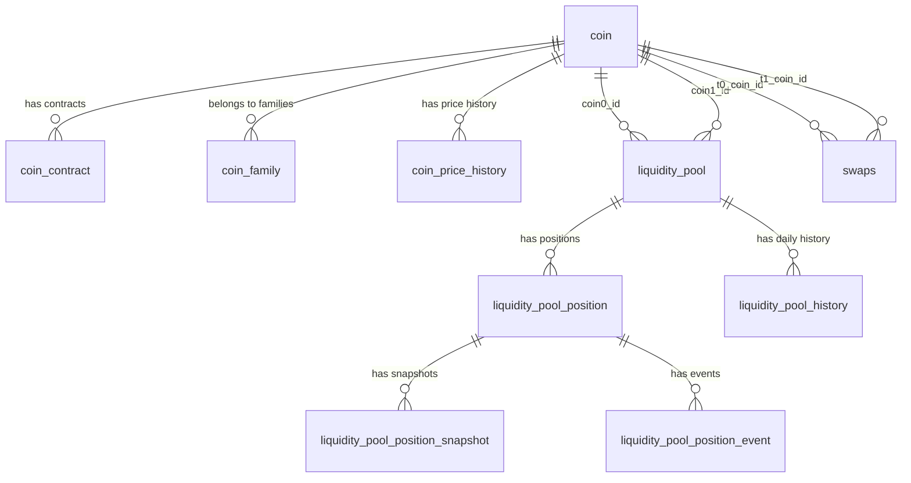

# Database Schema Documentation

## Overview

The Chaintelligence data warehouse uses PostgreSQL with the following table groups:

| # | Table | Purpose |
|---|---|---|
| 1 | `coin` | Asset registry with metadata, prices, and hardness rank |
| 2 | `coin_contract` | Multi-chain contract address mapping per coin |
| 3 | `coin_family` | Logical grouping of related assets (e.g. "USD" → USDC, USDT, DAI) |
| 4 | `coin_price_history` | Daily price snapshots for historical analysis |
| 5 | `liquidity_pool` | Static pool definitions (network, protocol, coin pair) |
| 6 | `liquidity_pool_position` | User positions within pools (ticks, ranges, token IDs) |
| 7 | `liquidity_pool_position_snapshot` | Time-series balance and fee data per position |
| 8 | `liquidity_pool_position_event` | On-chain lifecycle events (mints, burns, collects) |
| 9 | `liquidity_pool_history` | Aggregated daily pool metrics (volume, TVL) |
| 10 | `swaps` | Unified, monthly-partitioned swap event log |

Schema source: [init_db.sql](file:///Users/szabi/git/chaintelligence/chain-feeder/include/sql/init_db.sql), [create_swaps_table.sql](file:///Users/szabi/git/chaintelligence/chain-feeder/include/sql/create_swaps_table.sql)

---

## Conventions

- **Symbol casing**: `coin.symbol` is enforced uppercase via the `trg_coin_upper` database trigger. All inserts are automatically uppercased and truncated to 10 characters.
- **Contract casing**: `coin_contract.contract_address` is enforced lowercase via the `trg_coin_contract_address_lower` trigger.
- **Pair ordering**: In `liquidity_pool`, the two coins are ordered by hardness rank. `coin0` is the **softer** (lower hardness) asset, `coin1` is the **harder** (higher hardness, more stable) asset. Example: `ETH - USDC` where ETH (860) is coin0 and USDC (1000) is coin1.
- **Foreign keys**: Pool and family tables reference `coin.coin_id` (not `symbol`). This allows symbol renames without cascading updates.
- **Idempotency**: All DAG writes use `INSERT ... ON CONFLICT DO UPDATE` patterns.

---

## Tables

### 1. `coin`

The central asset registry. Every token tracked by the system has a row here.

**Primary Key**: `coin_id` (SMALLINT, auto-generated identity)
**Unique Constraints**: `symbol`, `cmc_id`

| Column | Type | Description |
|:---|:---|:---|
| `coin_id` | SMALLINT (PK) | Auto-generated identity. Referenced by all other tables. |
| `symbol` | VARCHAR(10) UNIQUE | Ticker symbol (e.g. `USDC`, `WETH`). Uppercase enforced by trigger. |
| `name` | VARCHAR(255) | Full name (e.g. "Wrapped Ether"). From CoinMarketCap. |
| `slug` | VARCHAR(255) | URL-safe slug (e.g. "wrapped-ether"). From CoinMarketCap. |
| `hardness` | INTEGER | Hardness rank. Higher = harder/more stable. Used for pair ordering. |
| `cmc_rank` | INTEGER | CoinMarketCap global rank. |
| `cmc_id` | INTEGER UNIQUE | CoinMarketCap ID. Used for price API calls. |
| `first_historical_data` | TIMESTAMPTZ | Earliest available historical data on CMC. |
| `image_url` | TEXT | URL to the token logo image. |
| `price` | NUMERIC | Current price in USD. Updated by `tiered_coin_price_ingestion`. |
| `price_timestamp` | TIMESTAMPTZ | When `price` was last updated. |
| `decimals` | INTEGER | Token decimals (default: 18). |
| `percent_change_1h` | NUMERIC | Price change % over 1 hour. |
| `percent_change_24h` | NUMERIC | Price change % over 24 hours. |
| `percent_change_7d` | NUMERIC | Price change % over 7 days. |
| `percent_change_30d` | NUMERIC | Price change % over 30 days. |
| `percent_change_60d` | NUMERIC | Price change % over 60 days. |
| `percent_change_90d` | NUMERIC | Price change % over 90 days. |
| `market_cap` | NUMERIC | Market capitalization in USD. |
| `market_cap_dominance` | NUMERIC | Market cap dominance percentage. |
| `fully_diluted_market_cap` | NUMERIC | Fully diluted market cap. |
| `tvl` | NUMERIC | Total Value Locked (DeFi protocols). |
| `total_supply` | NUMERIC | Total token supply. |
| `circulating_supply` | NUMERIC | Circulating token supply. |
| `max_supply` | NUMERIC | Maximum token supply (null if unlimited). |
| `cmc_last_updated` | TIMESTAMPTZ | Last update timestamp from CMC API. |

**Triggers**: `trg_coin_upper` — `BEFORE INSERT OR UPDATE` uppercases and truncates `symbol` to 10 chars.

---

### 2. `coin_contract`

Maps coins to their on-chain contract addresses across multiple chains.

**Primary Key**: (`coin_id`, `chain`)

| Column | Type | Description |
|:---|:---|:---|
| `coin_id` | SMALLINT (FK → coin) | References `coin.coin_id`. CASCADE on delete. |
| `chain` | VARCHAR(20) | Chain identifier: `ethereum`, `arbitrum`, `base`, `bsc`. |
| `contract_address` | VARCHAR(64) | Contract address. Lowercase enforced by trigger. |
| `decimals` | INTEGER | Token decimals on this chain (default: 18). |
| `is_native` | BOOLEAN | True for native gas tokens (ETH on Ethereum, etc.). |
| `verified_at` | TIMESTAMPTZ | When this mapping was last verified. |

**Triggers**: `trg_coin_contract_address_lower` — lowercases `contract_address` on insert/update.
**Indexes**: Unique on `(chain, LOWER(contract_address))`.

---

### 3. `coin_family`

Groups related tokens into families for tiered price updates and analysis (e.g. all USD stablecoins, all ETH derivatives).

**Primary Key**: (`name`, `coin_id`)

| Column | Type | Description |
|:---|:---|:---|
| `name` | VARCHAR(50) | Family name (e.g. `USD`, `EUR`, `ETH`, `BTC`, `GOLD`). |
| `coin_id` | SMALLINT (FK → coin) | Member coin. CASCADE on delete. |

Managed by the `coin_family_ingestion` DAG from [coin-families.yml](file:///Users/szabi/git/chaintelligence/chain-feeder/include/config/coin-families.yml).

---

### 4. `coin_price_history`

Daily price snapshots used for historical analysis and APR calculations.

**Primary Key**: `id` (SERIAL)
**Unique Constraint**: (`coin_id`, `timestamp`)

| Column | Type | Description |
|:---|:---|:---|
| `id` | SERIAL (PK) | Auto-increment ID. |
| `coin_id` | SMALLINT (FK → coin) | References `coin.coin_id`. CASCADE on delete. |
| `timestamp` | TIMESTAMPTZ | Time of price recording. |
| `price` | NUMERIC | Asset price in USD at that time. |

Written by the `coin_price_history_feeder` DAG (daily at 1 AM).

---

### 5. `liquidity_pool`

Represents a unique liquidity pool on a specific network and protocol. Coin ordering follows the hardness convention.

**Primary Key**: `id` (SERIAL)
**Unique Constraint**: (`chain_id`, `protocol_id`, `pool_name`, `fee_bps`)

| Column | Type | Description |
|:---|:---|:---|
| `id` | SERIAL (PK) | Unique pool ID. |
| `chain_id` | SMALLINT (FK → chain) | Blockchain network lookup ID. |
| `protocol_id` | SMALLINT (FK → protocol) | DEX protocol lookup ID. |
| `pool_name` | VARCHAR(255) | Canonical name: `{coin0} - {coin1}` (e.g. `ETH - USDC`). |
| `fee_bps` | DOUBLE PRECISION | Fee in basis points (5 = 0.05%); NULL = dynamic fee. |
| `coin0_id` | SMALLINT (FK → coin) | Softer asset. CASCADE on delete. |
| `coin1_id` | SMALLINT (FK → coin) | Harder asset. CASCADE on delete. |
| `pool_address` | VARCHAR(100) | On-chain pool contract address (V2/V3) or compound ID (V4). |
| `pool_id` | VARCHAR(66) | V4 poolId (bytes32 hex). NULL for V2/V3. |
| `reverted` | BOOLEAN | True if coin ordering is reversed vs on-chain token0/token1. |
| `created_at` | TIMESTAMP | Row creation timestamp. |

**Ordering rule**: `coin1.hardness > coin0.hardness`. Pairs are stored as `[Softer] - [Harder]`.

---

### 6. `liquidity_pool_position`

Represents a user's specific position within a pool. For concentrated liquidity (V3/V4), includes tick range and pricing bounds.

**Primary Key**: `id` (SERIAL)
**Unique Constraint**: `position_key`

| Column | Type | Description |
|:---|:---|:---|
| `id` | SERIAL (PK) | Unique position ID. |
| `pool_id` | INT (FK → liquidity_pool) | The pool this position belongs to. |
| `position_key` | VARCHAR(100) UNIQUE | Deterministic key (e.g. `uniswapv3-Ethereum-{token_id}`). |
| `wallet_address` | VARCHAR(42) | The wallet owning this position. |
| `token_id` | VARCHAR(50) | NFT token ID (V3/V4 positions are NFTs). |
| `tick_lower` | INTEGER | Lower tick boundary of the range. |
| `tick_upper` | INTEGER | Upper tick boundary of the range. |
| `price_lower` | NUMERIC | Lower price boundary (derived from tick_lower). |
| `price_upper` | NUMERIC | Upper price boundary (derived from tick_upper). |
| `current_tick` | INTEGER | Current pool tick (updated by range backfill). |
| `current_price` | NUMERIC | Current pool price (updated by range backfill). |
| `fee_tier` | VARCHAR(10) | Position-level fee tier (copied from pool or fetched). |
| `last_claim_scan_block` | INTEGER | Last block scanned for fee claims by `backfill_claims_rpc`. |
| `created_at` | TIMESTAMP | Row creation timestamp. |

> [!NOTE]
> `current_tick` and `current_price` on the position table represent the **last fetched** pool state at range backfill time. The snapshot table also stores per-snapshot `current_tick`/`current_price` for time-series accuracy.

---

### 7. `liquidity_pool_position_snapshot`

Time-series data capturing position state at each ingestion cycle. Assets and fees are flattened as coin0/coin1 columns matching the pool's pair ordering.

**Primary Key**: `id` (SERIAL)

| Column | Type | Description |
|:---|:---|:---|
| `id` | SERIAL (PK) | Snapshot ID. |
| `position_id` | INT (FK → liquidity_pool_position) | The position this snapshot belongs to. |
| `timestamp` | TIMESTAMP | Time of data capture. |
| `balance_usd` | NUMERIC | Total USD value of the position. |
| `coin0_amount` | NUMERIC | Amount of pool's coin0 held in position. |
| `coin1_amount` | NUMERIC | Amount of pool's coin1 held in position. |
| `coin0_claimable_amount` | NUMERIC | Unclaimed (pending) coin0 fees. |
| `coin1_claimable_amount` | NUMERIC | Unclaimed (pending) coin1 fees. |
| `coin0_claimed_amount` | NUMERIC | Cumulative collected coin0 fees. Updated by `backfill_claims_rpc`. |
| `coin1_claimed_amount` | NUMERIC | Cumulative collected coin1 fees. Updated by `backfill_claims_rpc`. |
| `current_tick` | INTEGER | Pool tick at snapshot time. |
| `current_price` | NUMERIC | Pool price at snapshot time. |
| `in_range` | BOOLEAN | Whether position was in range at snapshot time. |

---

### 8. `liquidity_pool_position_event`

On-chain lifecycle events for positions: liquidity additions, removals, and fee collections.

**Primary Key**: `id` (SERIAL)
**Unique Constraint**: (`position_id`, `tx_hash`, `event_type`)

| Column | Type | Description |
|:---|:---|:---|
| `id` | SERIAL (PK) | Event ID. |
| `position_id` | INT (FK → liquidity_pool_position) | The position this event belongs to. |
| `tx_hash` | VARCHAR(66) | Transaction hash. |
| `block_number` | INTEGER | Block number of the event. |
| `timestamp` | TIMESTAMPTZ | Block timestamp. |
| `event_type` | VARCHAR(50) | Event type: `IncreaseLiquidity`, `DecreaseLiquidity`, `Collect`. |
| `amount0` | NUMERIC | Token0 amount involved (default: 0). |
| `amount1` | NUMERIC | Token1 amount involved (default: 0). |
| `amount_usd` | NUMERIC | USD value of the event (default: 0). |
| `liquidity_change` | NUMERIC | Liquidity delta (positive = add, negative = remove). |
| `tick_lower` | INTEGER | Tick lower at time of event. |
| `tick_upper` | INTEGER | Tick upper at time of event. |
| `created_at` | TIMESTAMP | Row creation timestamp. |

Written by `backfill_position_events` DAG and `rpc_lp_ingestion_v2`.

---

### 9. `liquidity_pool_history`

Aggregated daily performance metrics per pool. Used for volume and TVL analytics.

**Primary Key**: `id` (SERIAL)
**Unique Constraint**: (`pool_id`, `date`)

| Column | Type | Description |
|:---|:---|:---|
| `id` | SERIAL (PK) | History record ID. |
| `pool_id` | INT (FK → liquidity_pool) | The pool. |
| `date` | DATE | Calendar date (daily granularity). |
| `tx_count` | INTEGER | Number of swap transactions that day (default: 0). |
| `volume_usd` | NUMERIC | Total swap volume in USD (default: 0). |
| `tvl_usd` | NUMERIC | Total Value Locked at end of day (default: 0). |

Written by `uniswap_v3_history_sync`, `uniswap_v4_history_sync`, `pancakeswap_v4_history_sync`.

---

### 10. `swaps`

Unified swap event log across all protocols and chains. Monthly range-partitioned on `ts`. Replaces the legacy per-protocol tables (`uniswap_v2_swaps`, `uniswap_v3_swaps`, `uniswap_v4_swaps`).

**Primary Key**: (`ts`, `tx_hash`, `log_index`) — includes partition key
**Partitioning**: `RANGE(ts)` by month (e.g. `swaps_2026_07`)

| Column | Type | Description |
|:---|:---|:---|
| `tx_hash` | VARCHAR(80) | Transaction hash (part of PK). |
| `log_index` | INT | Log index within the tx (part of PK). |
| `ts` | TIMESTAMPTZ | Block timestamp (partition key, part of PK). |
| `chain_id` | SMALLINT (FK → chain) | Blockchain network lookup ID. |
| `protocol_id` | SMALLINT (FK → protocol) | DEX protocol lookup ID. |
| `t0_coin_id` | SMALLINT (FK → coin) | `coin.coin_id` for token0. |
| `t1_coin_id` | SMALLINT (FK → coin) | `coin.coin_id` for token1. |
| `amount0` | DOUBLE PRECISION | Signed amount of token0. |
| `amount1` | DOUBLE PRECISION | Signed amount of token1. |
| `amount_usd` | DOUBLE PRECISION | Normalized USD value of the swap. |
| `fee_bps` | DOUBLE PRECISION | Fee in basis points (5 = 0.05%); NULL = dynamic fee. |
| `fee_display` | VARCHAR(20) | Original display string (e.g. `0.05%`). |

Schema source: [create_swaps_table.sql](file:///Users/szabi/git/chaintelligence/chain-feeder/include/sql/create_swaps_table.sql)

---

## Views

### `v_lp_snapshots_summary`

A complex view that reconstructs a UI-ready object from the normalized snapshot tables. Used by the API endpoint `/api/lp/position-summary`.

Joins `liquidity_pool_position_snapshot` → `liquidity_pool_position` → `liquidity_pool` → `coin` (twice, for coin0 and coin1).

Provides:
- `position_label` — human-readable label with Token ID (e.g. `ETH - USDC (Token ID: 103718)`)
- `assets` — JSONB array of `{symbol, balance, balanceUSD}` objects
- `unclaimed` — JSONB array of unclaimed fee amounts
- `images` — JSONB array of coin logo URLs
- Range data (`tick_lower`, `tick_upper`, `current_tick`, `price_lower`, `price_upper`, `current_price`, `in_range`, `fee_tier`)
- Claimed amounts (`coin0_claimed_amount`, `coin1_claimed_amount`)

Defined in [init_db.sql](file:///Users/szabi/git/chaintelligence/chain-feeder/include/sql/init_db.sql#L408-L475).

---

## Triggers

| Trigger | Table | Action | Description |
|---|---|---|---|
| `trg_coin_upper` | `coin` | BEFORE INSERT/UPDATE | Uppercases and truncates `symbol` to 10 chars |
| `trg_coin_contract_address_lower` | `coin_contract` | BEFORE INSERT/UPDATE | Lowercases `contract_address` |

---

## Legacy Tables

The following tables still exist in `init_db.sql` but are **no longer actively written to**. All swap data now goes to the unified `swaps` table.

| Table | Status | Replacement |
|---|---|---|
| `uniswap_v2_swaps` | Legacy | `swaps` (protocol = `Uniswap V2`) |
| `uniswap_v3_swaps` | Legacy | `swaps` (protocol = `Uniswap V3`) |
| `uniswap_v4_swaps` | Legacy | `swaps` (protocol = `Uniswap V4`) |

---

## 📈 Recommended Improvements

Based on a review of the current schema, queries, and ETL pipelines, here are the key architectural improvements recommended for better performance, clarity, and adherence to best practices.

### 1. Performance: Missing Indexes
- **Snapshots**: The `liquidity_pool_position_snapshot` table will become the largest table in the database (recording every position every 15-60 minutes). It currently lacks indexes entirely. 
  - **Fix**: Add indexes on `position_id` and `timestamp`. Without these, any API query (like `/api/lp/position-summary`) fetching the latest snapshot per position will trigger a massive Full Table Scan.
  - `CREATE INDEX idx_snapshot_pos_time ON liquidity_pool_position_snapshot(position_id, timestamp DESC);`
- **Positions by Wallet**: The API queries positions by `wallet_address`.
  - **Fix**: Add an index: `CREATE INDEX idx_lpp_wallet ON liquidity_pool_position(wallet_address);`

### 2. Performance: Partitioning the Snapshot Table
- The `swaps` table is beautifully partitioned by month (`RANGE(ts)`). 
- **Fix**: The `liquidity_pool_position_snapshot` table will grow exponentially faster than swaps if tracking many wallets. It should be partitioned by `timestamp` (e.g., monthly) just like `swaps`. This allows fast retrieval of recent data and easy pruning of data that is older than 6 months.

### 3. Best Practices: Precision Loss in Token Amounts
- Blockchain token amounts can reach enormous numbers (e.g., $10^{18}$ for 1 ETH, or higher for meme coins).
- The `swaps` table uses `DOUBLE PRECISION` for `amount0`/`amount1`. Floating point numbers lose precision beyond ~15-17 significant digits, which leads to rounding errors when storing exact token wei amounts.
- **Fix**: Use `NUMERIC` for all raw token amounts (as is done in `liquidity_pool_position_snapshot` and `liquidity_pool_position_event`) to guarantee mathematical exactness. Reserve `DOUBLE PRECISION` exclusively for USD fiat values (`amount_usd`), where micro-precision isn't critical.

### 4. Best Practices: Timezones (TIMESTAMPTZ vs TIMESTAMP)
- The schema mixes `TIMESTAMP WITH TIME ZONE` (`swaps`, `coin_price_history`, `liquidity_pool_position_event`) with `TIMESTAMP` without timezone (`liquidity_pool_position_snapshot`, `liquidity_pool`).
- **Fix**: Standardize on `TIMESTAMPTZ` globally. Storing timestamps without time zones in Postgres is an anti-pattern that can lead to subtle UI bugs when clients in different timezones request data or when the server DST changes.

### 5. Design Clarity: The Summary View & USD Caching
- The view `v_lp_snapshots_summary` dynamically builds complex JSON arrays using `jsonb_build_array` and hardcodes `0` for `asset0_usd`, `asset1_usd`, `reward0_usd`, and `reward1_usd`. 
- **Fix**: The UI clearly wants to show USD value breakdowns for tokens and rewards, but the ETL only saves total `balance_usd`. The ETL pipelines (e.g., `graph_lp_ingestion`) should calculate and save `coin0_usd`, `coin1_usd`, `reward0_usd`, and `reward1_usd` directly into the `liquidity_pool_position_snapshot` table. This removes the need to hardcode `0` in the view and allows the frontend to show accurate portfolio breakdowns instantly.
