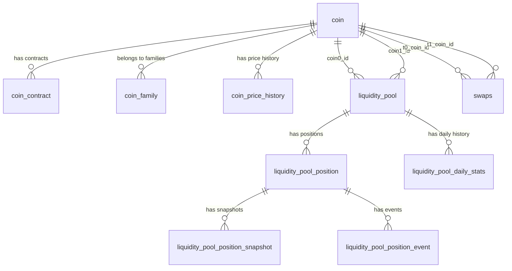

# Database Schema Documentation

## Overview

The Chaintelligence data warehouse uses PostgreSQL with the following table groups:

```mermaid
erDiagram
    coin ||--o{ coin_contract : "has contracts"
    coin ||--o{ coin_family : "belongs to families"
    coin ||--o{ coin_price_history : "has price history"
    coin ||--o{ liquidity_pool : "coin0_id"
    coin ||--o{ liquidity_pool : "coin1_id"
    coin ||--o{ swaps : "t0_coin_id"
    coin ||--o{ swaps : "t1_coin_id"
    liquidity_pool ||--o{ liquidity_pool_position : "has positions"
    liquidity_pool ||--o{ liquidity_pool_daily_stats : "has daily history"
    liquidity_pool_position ||--o{ liquidity_pool_position_snapshot : "has snapshots"
    liquidity_pool_position ||--o{ liquidity_pool_position_event : "has events"
```

| # | Table | Purpose |
|---|---|---|
| 1 | `coin` | Asset registry with metadata, prices, and hardness rank |
| 2 | `coin_contract` | Multi-chain contract address mapping per coin |
| 3 | `coin_family` | Logical grouping of related assets (e.g. "USD" → USDC, USDT, DAI) |
| 4 | `coin_price_history` | Daily price snapshots for historical analysis |
| 5 | `liquidity_pool` | Static pool definitions (network, protocol, coin pair) |
| 6 | `liquidity_pool_position` | User positions within pools (ticks, ranges, token IDs) |
| 7 | `liquidity_pool_position_snapshot` | Time-series balance and fee data per position |
| 8 | `liquidity_pool_position_event` | On-chain lifecycle events (mints, burns, collects) |
| 9 | `liquidity_pool_daily_stats` | Aggregated daily pool metrics (volume, TVL) |
| 10 | `swaps_staging` | **Canonical** short-lived, monthly-partitioned swap event log |
| 11 | `swaps` | Legacy compatibility mirror of `swaps_staging` (write while `SWAP_LEGACY_MIRROR=true`) |
| 12 | `ingestion_state` | Per (network, protocol) ingestion watermark cursor |
| 13 | `route_classification_queue` | Async queue of tx hashes awaiting route classification |
| — | Route taxonomy | `origin_destination_pair`, `route`, `route_hop` (see below) |
| — | Route/pool facts | `route_daily_stats`, `route_daily_stats_bucket`, `liquidity_pool_daily_stats_bucket` |
| — | Control plane | `od_set*`, `source_day_coverage`, `classification_day_coverage`, `product_day_coverage`, `dirty_route_day`, `dirty_pool_day`, `od_set_pool_daily_stats` |

Schema source: [init_db.sql](file:///Users/szabi/git/chaintelligence/chain-feeder/include/sql/init_db.sql), [create_swaps_table.sql](file:///Users/szabi/git/chaintelligence/chain-feeder/include/sql/create_swaps_table.sql)

---

## Conventions

- **Symbol casing**: `coin.symbol` is enforced uppercase via the `trg_coin_upper` database trigger. All inserts are automatically uppercased and truncated to 10 characters.
- **Contract casing**: `coin_contract.contract_address` is enforced lowercase via the `trg_coin_contract_address_lower` trigger.
- **Pair ordering**: In `liquidity_pool`, the two coins are ordered by hardness rank. `coin0` is the **softer** (lower hardness) asset, `coin1` is the **harder** (higher hardness, more stable) asset. Example: `ETH - USDC` where ETH (860) is coin0 and USDC (1000) is coin1.
- **Foreign keys**: Pool and family tables reference `coin.coin_id` (not `symbol`). This allows symbol renames without cascading updates.
- **Idempotency**: All DAG writes use `INSERT ... ON CONFLICT DO UPDATE` patterns.

---

## Tables

### 1. `coin`

The central asset registry. Every token tracked by the system has a row here.

**Primary Key**: `coin_id` (SMALLINT, auto-generated identity)
**Unique Constraints**: `symbol`, `cmc_id`

| Column | Type | Description |
|:---|:---|:---|
| `coin_id` | SMALLINT (PK) | Auto-generated identity. Referenced by all other tables. |
| `symbol` | VARCHAR(10) UNIQUE | Ticker symbol (e.g. `USDC`, `WETH`). Uppercase enforced by trigger. |
| `name` | VARCHAR(255) | Full name (e.g. "Wrapped Ether"). From CoinMarketCap. |
| `slug` | VARCHAR(255) | URL-safe slug (e.g. "wrapped-ether"). From CoinMarketCap. |
| `hardness` | INTEGER | Hardness rank. Higher = harder/more stable. Used for pair ordering. |
| `cmc_rank` | INTEGER | CoinMarketCap global rank. |
| `cmc_id` | INTEGER UNIQUE | CoinMarketCap ID. Used for price API calls. |
| `first_historical_data` | TIMESTAMPTZ | Earliest available historical data on CMC. |
| `image_url` | TEXT | URL to the token logo image. |
| `price` | NUMERIC | Current price in USD. Updated by `cmc_global_coin_price` (triggered by `cmc_global_coin_tiered_price`). |
| `price_timestamp` | TIMESTAMPTZ | When `price` was last updated. |
| `decimals` | INTEGER | Token decimals (default: 18). |
| `percent_change_1h` | NUMERIC | Price change % over 1 hour. |
| `percent_change_24h` | NUMERIC | Price change % over 24 hours. |
| `percent_change_7d` | NUMERIC | Price change % over 7 days. |
| `percent_change_30d` | NUMERIC | Price change % over 30 days. |
| `percent_change_60d` | NUMERIC | Price change % over 60 days. |
| `percent_change_90d` | NUMERIC | Price change % over 90 days. |
| `market_cap` | NUMERIC | Market capitalization in USD. |
| `market_cap_dominance` | NUMERIC | Market cap dominance percentage. |
| `fully_diluted_market_cap` | NUMERIC | Fully diluted market cap. |
| `tvl` | NUMERIC | Total Value Locked (DeFi protocols). |
| `total_supply` | NUMERIC | Total token supply. |
| `circulating_supply` | NUMERIC | Circulating token supply. |
| `max_supply` | NUMERIC | Maximum token supply (null if unlimited). |
| `cmc_last_updated` | TIMESTAMPTZ | Last update timestamp from CMC API. |

**Triggers**: `trg_coin_upper` — `BEFORE INSERT OR UPDATE` uppercases and truncates `symbol` to 10 chars.

---

### 2. `coin_contract`

Maps coins to their on-chain contract addresses across multiple chains.

**Primary Key**: (`coin_id`, `chain`)

| Column | Type | Description |
|:---|:---|:---|
| `coin_id` | SMALLINT (FK → coin) | References `coin.coin_id`. CASCADE on delete. |
| `chain` | VARCHAR(20) | Chain identifier: `ethereum`, `arbitrum`, `base`, `bsc`. |
| `contract_address` | VARCHAR(64) | Contract address. Lowercase enforced by trigger. |
| `decimals` | INTEGER | Token decimals on this chain (default: 18). |
| `is_native` | BOOLEAN | True for native gas tokens (ETH on Ethereum, etc.). |
| `verified_at` | TIMESTAMPTZ | When this mapping was last verified. |

**Triggers**: `trg_coin_contract_address_lower` — lowercases `contract_address` on insert/update.
**Indexes**: Unique on `(chain, LOWER(contract_address))`.

---

### 3. `coin_family`

Groups related tokens into families for tiered price updates and analysis (e.g. all USD stablecoins, all ETH derivatives).

**Primary Key**: (`name`, `coin_id`)

| Column | Type | Description |
|:---|:---|:---|
| `name` | VARCHAR(50) | Family name (e.g. `USD`, `EUR`, `ETH`, `BTC`, `GOLD`). |
| `coin_id` | SMALLINT (FK → coin) | Member coin. CASCADE on delete. |

Managed by the `yaml_global_coin_family` DAG from [coin-families.yml](file:///Users/szabi/git/chaintelligence/config/coin-families.yml).

---

### 4. `coin_price_history`

Daily price snapshots used for historical analysis and APR calculations.

**Primary Key**: `id` (SERIAL)
**Unique Constraint**: (`coin_id`, `timestamp`)

| Column | Type | Description |
|:---|:---|:---|
| `id` | SERIAL (PK) | Auto-increment ID. |
| `coin_id` | SMALLINT (FK → coin) | References `coin.coin_id`. CASCADE on delete. |
| `timestamp` | TIMESTAMPTZ | Time of price recording. |
| `price` | NUMERIC | Asset price in USD at that time. |

Written by the `defillama_global_coin_price_history` DAG (daily at 1 AM).

---

### 5. `liquidity_pool`

Represents a unique liquidity pool on a specific network and protocol. Coin ordering follows the hardness convention.

**Primary Key**: `id` (SERIAL)
**Unique Constraint**: (`chain_id`, `protocol_id`, `pool_name`, `fee_bps`)

| Column | Type | Description |
|:---|:---|:---|
| `id` | SERIAL (PK) | Unique pool ID. |
| `chain_id` | SMALLINT (FK → chain) | Blockchain network lookup ID. |
| `protocol_id` | SMALLINT (FK → protocol) | DEX protocol lookup ID. |
| `pool_name` | VARCHAR(255) | Canonical name: `{coin0} - {coin1}` (e.g. `ETH - USDC`). |
| `fee_bps` | DOUBLE PRECISION | Fee in basis points (5 = 0.05%); NULL = dynamic fee. |
| `coin0_id` | SMALLINT (FK → coin) | Softer asset. CASCADE on delete. |
| `coin1_id` | SMALLINT (FK → coin) | Harder asset. CASCADE on delete. |
| `pool_address` | VARCHAR(100) | On-chain pool contract address (V2/V3) or compound ID (V4). |
| `pool_id` | VARCHAR(66) | V4 poolId (bytes32 hex). NULL for V2/V3. |
| `reverted` | BOOLEAN | True if coin ordering is reversed vs on-chain token0/token1. |
| `created_at` | TIMESTAMP | Row creation timestamp. |

**Ordering rule**: `coin1.hardness > coin0.hardness`. Pairs are stored as `[Softer] - [Harder]`.

---

### 6. `liquidity_pool_position`

Represents a user's specific position within a pool. For concentrated liquidity (V3/V4), includes tick range and pricing bounds.

**Primary Key**: `id` (SERIAL)
**Unique Constraint**: `position_key`

| Column | Type | Description |
|:---|:---|:---|
| `id` | SERIAL (PK) | Unique position ID. |
| `pool_id` | INT (FK → liquidity_pool) | The pool this position belongs to. |
| `position_key` | VARCHAR(100) UNIQUE | Deterministic key (e.g. `uniswapv3-Ethereum-{token_id}`). |
| `wallet_address` | VARCHAR(42) | The wallet owning this position. |
| `token_id` | VARCHAR(50) | NFT token ID (V3/V4 positions are NFTs). |
| `tick_lower` | INTEGER | Lower tick boundary of the range. |
| `tick_upper` | INTEGER | Upper tick boundary of the range. |
| `price_lower` | NUMERIC | Lower price boundary (derived from tick_lower). |
| `price_upper` | NUMERIC | Upper price boundary (derived from tick_upper). |
| `current_tick` | INTEGER | Current pool tick (updated by range backfill). |
| `current_price` | NUMERIC | Current pool price (updated by range backfill). |
| `fee_tier` | VARCHAR(10) | Position-level fee tier (copied from pool or fetched). |
| `last_claim_scan_block` | INTEGER | Last block scanned for fee claims by `rpc_all_uniswap_v3_liquidity_pool_position_snapshot_claims`. |
| `created_at` | TIMESTAMP | Row creation timestamp. |

> [!NOTE]
> `current_tick` and `current_price` on the position table represent the **last fetched** pool state at range backfill time. The snapshot table also stores per-snapshot `current_tick`/`current_price` for time-series accuracy.

---

### 7. `liquidity_pool_position_snapshot`

Time-series data capturing position state at each ingestion cycle. Assets and fees are flattened as coin0/coin1 columns matching the pool's pair ordering.

**Primary Key**: `id` (SERIAL)

| Column | Type | Description |
|:---|:---|:---|
| `id` | SERIAL (PK) | Snapshot ID. |
| `position_id` | INT (FK → liquidity_pool_position) | The position this snapshot belongs to. |
| `timestamp` | TIMESTAMP | Time of data capture. |
| `balance_usd` | NUMERIC | Total USD value of the position. |
| `coin0_amount` | NUMERIC | Amount of pool's coin0 held in position. |
| `coin1_amount` | NUMERIC | Amount of pool's coin1 held in position. |
| `coin0_claimable_amount` | NUMERIC | Unclaimed (pending) coin0 fees. |
| `coin1_claimable_amount` | NUMERIC | Unclaimed (pending) coin1 fees. |
| `coin0_claimed_amount` | NUMERIC | Cumulative collected coin0 fees. Updated by `rpc_all_uniswap_v3_liquidity_pool_position_snapshot_claims`. |
| `coin1_claimed_amount` | NUMERIC | Cumulative collected coin1 fees. Updated by `rpc_all_uniswap_v3_liquidity_pool_position_snapshot_claims`. |
| `current_tick` | INTEGER | Pool tick at snapshot time. |
| `current_price` | NUMERIC | Pool price at snapshot time. |
| `in_range` | BOOLEAN | Whether position was in range at snapshot time. |

---

### 8. `liquidity_pool_position_event`

On-chain lifecycle events for positions: liquidity additions, removals, and fee collections.

**Primary Key**: `id` (SERIAL)
**Unique Constraint**: (`position_id`, `tx_hash`, `event_type`)

| Column | Type | Description |
|:---|:---|:---|
| `id` | SERIAL (PK) | Event ID. |
| `position_id` | INT (FK → liquidity_pool_position) | The position this event belongs to. |
| `tx_hash` | VARCHAR(66) | Transaction hash. |
| `block_number` | INTEGER | Block number of the event. |
| `timestamp` | TIMESTAMPTZ | Block timestamp. |
| `event_type` | VARCHAR(50) | Event type: `IncreaseLiquidity`, `DecreaseLiquidity`, `Collect`. |
| `amount0` | NUMERIC | Token0 amount involved (default: 0). |
| `amount1` | NUMERIC | Token1 amount involved (default: 0). |
| `amount_usd` | NUMERIC | USD value of the event (default: 0). |
| `liquidity_change` | NUMERIC | Liquidity delta (positive = add, negative = remove). |
| `tick_lower` | INTEGER | Tick lower at time of event. |
| `tick_upper` | INTEGER | Tick upper at time of event. |
| `created_at` | TIMESTAMP | Row creation timestamp. |

Written by `rpc_all_uniswap_v3_liquidity_pool_position_event` and `rpc_ethereum_uniswap_v3_liquidity_pool_position`.

---

### 9. `liquidity_pool_daily_stats`

Aggregated daily performance metrics per pool. Used for volume and TVL analytics.

**Primary Key**: (`pool_id`, `day`)

| Column | Type | Description |
|:---|:---|:---|
| `pool_id` | INT (FK → liquidity_pool) | The pool. |
| `day` | DATE | Calendar date (daily granularity). |
| `tx_count` | INTEGER | Number of swap transactions that day (default: 0). |
| `volume_usd` | DOUBLE PRECISION | Total swap volume in USD (default: 0). |
| `tvl_usd` | DOUBLE PRECISION | Total Value Locked at end of day (default: 0). |

Written by the per-network `graph_*_liquidity_pool_daily_stats` DAGs, `global_liquidity_pool_daily_stats_rollup`, and `rpc_tvl_sync`.

---

### 10. `swaps_staging` (canonical raw store)

Short-lived unified swap event log across all protocols and chains. Monthly range-partitioned on `ts`. This is the **authoritative** raw store the ETL writes to; rows are pruned once their route/pool aggregates exist. The legacy `swaps` table (section 11) is only a compatibility mirror during switchover.

**Primary Key**: (`ts`, `tx_hash`, `log_index`) — includes partition key
**Partitioning**: `RANGE(ts)` by month (e.g. `swaps_staging_2026_08`)

| Column | Type | Description |
|:---|:---|:---|
| `tx_hash` | VARCHAR(80) | Transaction hash (part of PK). |
| `log_index` | INT | Log index within the tx (part of PK). |
| `ts` | TIMESTAMPTZ | Block timestamp (partition key, part of PK). |
| `network` / `protocol` | VARCHAR | Chain / DEX protocol. |
| `pool_id` | INT (FK → liquidity_pool) | The pool this swap belongs to. |
| `amount0` / `amount1` | DOUBLE PRECISION | Signed token amounts. |
| `amount_usd` | DOUBLE PRECISION | Normalized USD value. |
| `route_id` | BIGINT (FK → route) | Route assigned by the classifier (may be NULL until classified). |

Indexes: `(tx_hash)`, `(pool_id, ts) INCLUDE (amount_usd, amount0, amount1)`, partial `(route_id) WHERE route_id IS NOT NULL`.

Schema source: [create_swaps_staging.sql](file:///Users/szabi/git/chaintelligence/chain-feeder/include/sql/create_swaps_staging.sql)

---

### 11. `swaps` (legacy mirror)

The original unified swap log. Now written only as a compatibility **mirror** of `swaps_staging` while `SWAP_LEGACY_MIRROR=true` (default), so legacy API raw-swap fallbacks keep working. Once those consumers are migrated, flip the flag to `false` and retire the table. Underlying schema matches `swaps_staging` (minus `network`/`protocol`).

Schema source: [create_swaps_table.sql](file:///Users/szabi/git/chaintelligence/chain-feeder/include/sql/create_swaps_table.sql), [normalize_swaps_pool_id.sql](file:///Users/szabi/git/chaintelligence/chain-feeder/include/sql/normalize_swaps_pool_id.sql)

---

## Route taxonomy

Derived tables that encode the topology of routing across the unified `swaps` log. Legs are grouped per tx hash and ordered by log index; a contiguous chain of swap legs (hop `N`'s output token == hop `N+1`'s input token) forms one route. Multiple disjoint chains in a single tx each become their own route (read by [route_classifier.py](file:///Users/szabi/git/chaintelligence/chain-feeder/include/route_classifier.py)). Round-trip routes where the origin contract equals the destination contract are valid; directed pairs `(A,B)` and `(B,A)` are distinct.

Schema source: [create_route_tables.sql](file:///Users/szabi/git/chaintelligence/chain-feeder/include/sql/create_route_tables.sql), §8.5 of [init_db.sql](file:///Users/szabi/git/chaintelligence/chain-feeder/include/sql/init_db.sql)

### `origin_destination_pair`

Coarse identity of a route's endpoints. Key = `(chain_id, origin_contract, dest_contract)`; identical contracts found again idempotently reuse the row.

| Column | Type | Description |
|:---|:---|:---|
| `id` | SERIAL PK | Stable pair id. |
| `chain_id` | SMALLINT (FK → chain) | Chain the pair was first seen on. |
| `origin_contract` | VARCHAR(64) | Input token contract (lowercased). |
| `dest_contract` | VARCHAR(64) | Final output token contract (lowercased). |
| `origin_coin_id` / `dest_coin_id` | INTEGER (FK → coin) | Enriched coin references, may be NULL. |
| `origin_symbol` / `dest_symbol` | VARCHAR(10) | Symbol display metadata. |
| `first_seen` / `last_seen` | TIMESTAMPTZ | First/last observation timestamps. |

### `route`

One specific directed path between a pair, identified by its ordered pool sequence.

| Column | Type | Description |
|:---|:---|:---|
| `route_id` | SERIAL PK | Route id; referenced by `swaps.route_id`. |
| `pair_id` | INTEGER (FK → origin_destination_pair) | Owning pair. |
| `chain_id` | SMALLINT (FK → chain) | Chain the route was first seen on. |
| `hops` | SMALLINT | Number of hops (legs) in the route. |
| `canonical_key` | TEXT UNIQUE | `"{pair_id}:{pool1.id}:{pool2.id}:..."` — idempotency key. |
| `first_seen` / `last_seen` | TIMESTAMPTZ | First/last observation timestamps. |

### `route_hop`

Normalized graph edges: one row per pool hop, preserving order.

| Column | Type | Description |
|:---|:---|:---|
| `route_id` | INTEGER (FK → route, cascade) | Owning route. |
| `seq` | SMALLINT, part of PK | Order within the route (0-based). |
| `pool_id` | INTEGER (FK → liquidity_pool) | The pool executing this hop. |
| `token_in` / `token_out` | VARCHAR(64) | Hop endpoints (lowercased contracts). |

Primary key: `(route_id, seq)`.

### `route_daily_stats`

Pre-aggregated rollup read model. One row per `(route, day)`. Written idempotently (DELETE+INSERT per day) by `route_classifier.compute_daily_stats` / the [route_daily_stats_rollup.py](file:///Users/szabi/git/chaintelligence/chain-feeder/dags/route_daily_stats_rollup.py) DAG. This is the fast read path consumed by `api/routing/postgres_fetcher.fetch_route_stats`.

| Column | Type | Description |
|:---|:---|:---|
| `route_id` | INTEGER (FK → route, ON DELETE CASCADE) | Owning route. |
| `day` | DATE | UTC day of the aggregation bucket. |
| `tx_count` | INT | Number of distinct transactions attributed to this (route, day). |
| `swap_count` | INT | Number of legs (swap events) attributed. |
| `volume_usd` | DOUBLE PRECISION | Sum of `amount_usd` over legs whose input contract == pair origin. |

Primary key: `(route_id, day)`; index on `day` for windowed reads.

The API's `/api/routes/analyze` first tries to read these stats per requested direction and falls back to the streaming `swaps`-sweep + `RouteAnalyzer` path when the route tables are empty.

### `route_daily_stats_bucket`

Compact log-volume distribution for **every** route. One row per `(route, day, bucket_index)`; each routed transaction contributes its first route leg once. Bucket parameters (`bucket_count`, `min_amount_usd`, `max_amount_usd`) are global, from `config/swap-distribution.yaml`. Written by `route_classifier.recompute_distribution_buckets` via the `dirty_day_materializer` and `route_daily_stats_rollup` DAGs, which bucket all routes with swap legs in the window.

| Column | Type | Description |
|:---|:---|:---|
| `route_id` | BIGINT (FK → route, ON DELETE CASCADE) | Owning route. |
| `day` | DATE | UTC day of the aggregation bucket. |
| `bucket_index` | SMALLINT | 1-based log-volume bin (1..256). |
| `tx_count` | INT | Number of distinct transactions in the bin. |
| `sample_count` | BIGINT | Number of samples in the bin (== tx_count here). |
| `volume_usd` | DOUBLE PRECISION | Sum of first-leg `amount_usd` in the bin. |
| `fees_usd` | DOUBLE PRECISION | Sum of `amount_usd * fee_bps / 10000` in the bin. |
| `log_sum`, `log_sum2` | DOUBLE PRECISION | Log-volume moments for lognormal fitting. |

Primary key: `(route_id, day, bucket_index)`; index on `(day, route_id)`.

### `liquidity_pool_daily_stats_bucket`

Pool-grain mirror of the route bucket table for **every** pool. One row per `(pool_id, day, bucket_index)`; each transaction contributes its first swap leg on the pool once. Bucket parameters are global, from `config/swap-distribution.yaml`. Written by `route_classifier.recompute_pool_distribution_buckets` via the `dirty_day_materializer`, `route_daily_stats_rollup`, and `global_liquidity_pool_daily_stats_rollup` DAGs, which bucket all pools with swap legs in the window.

| Column | Type | Description |
|:---|:---|:---|
| `pool_id` | INTEGER (FK → liquidity_pool, ON DELETE CASCADE) | Owning pool. |
| `day` | DATE | UTC day of the aggregation bucket. |
| `bucket_index` | SMALLINT | 1-based log-volume bin (1..256). |
| `tx_count` | INT | Number of distinct transactions in the bin. |
| `sample_count` | BIGINT | Number of samples in the bin (== tx_count here). |
| `volume_usd` | DOUBLE PRECISION | Sum of first-leg `amount_usd` in the bin. |
| `fees_usd` | DOUBLE PRECISION | Sum of `amount_usd * fee_bps / 10000` in the bin. |
| `log_sum`, `log_sum2` | DOUBLE PRECISION | Log-volume moments for lognormal fitting. |

Primary key: `(pool_id, day, bucket_index)`; index on `(day, pool_id)`.

---

## Route classification queue & control plane

### `route_classification_queue`

Async work queue of transaction hashes awaiting route classification. One row per `tx_hash`; the producer resets it to `pending` whenever late legs arrive (bumping `generation`), and the worker only completes a row if its `claim_token` still matches `generation` (prevents a late-leg requeue from being overwritten).

| Column | Description |
|:---|:---|
| `tx_hash` (PK) | Transaction hash. |
| `status` | `pending` \| `processing` \| `complete`. |
| `generation` | Bumped by the producer on each requeue (part of the race fix). |
| `claim_token` | Generation captured at claim time; completion is conditional on it. |
| `available_at`, `claimed_at`, `attempts`, `last_error`, timestamps | Scheduling / error state. |

Schema source: [create_route_classification_queue.sql](file:///Users/szabi/git/chaintelligence/chain-feeder/include/sql/create_route_classification_queue.sql), [add_route_queue_generation.sql](file:///Users/szabi/git/chaintelligence/chain-feeder/include/sql/add_route_queue_generation.sql)

### `dirty_route_day` / `dirty_pool_day`

Fine-grained, idempotent work queue for the incremental materializer. The classifier writes the exact `(route_id|pool_id, day)` tuples it changed; `dirty_day_materializer` recomputes exactly those days.

| Column | Description |
|:---|:---|
| `route_id` / `pool_id` | Owning route or pool. |
| `day` | UTC day needing recompute. |

### `od_set*` (control plane)

Declarative O&D registry and coverage ledger (written by the control plane, read by the reconciliation planner):

| Table | Purpose |
|:---|:---|
| `od_set` / `od_product` / `od_set_product` | Compiled sets, product registry, per-product windows. |
| `od_set_pair_member` / `od_set_route_member` / `od_set_pool_member` | Resolved set membership bridges (pairs / routes / pools). |
| `source_day_coverage` / `classification_day_coverage` / `product_day_coverage` | Coverage ledger per (chain, day) and (product, chain, day). |
| `od_set_pool_daily_stats` | Optional `lp.set.daily_stats` product: per-set pool/day aggregates (a shared pool counted once), derived from `liquidity_pool_daily_stats` via `od_set_pool_member`. |

Schema sources: [add_od_control_plane.sql](file:///Users/szabi/git/chaintelligence/chain-feeder/include/sql/add_od_control_plane.sql), [add_od_set_pool_daily_stats.sql](file:///Users/szabi/git/chaintelligence/chain-feeder/include/sql/add_od_set_pool_daily_stats.sql)

## Views

### `v_lp_snapshots_summary`

A complex view that reconstructs a UI-ready object from the normalized snapshot tables. Used by the API endpoint `/api/lp/position-summary`.

Joins `liquidity_pool_position_snapshot` → `liquidity_pool_position` → `liquidity_pool` → `coin` (twice, for coin0 and coin1).

Provides:
- `position_label` — human-readable label with Token ID (e.g. `ETH - USDC (Token ID: 103718)`)
- `assets` — JSONB array of `{symbol, balance, balanceUSD}` objects
- `unclaimed` — JSONB array of unclaimed fee amounts
- `images` — JSONB array of coin logo URLs
- Range data (`tick_lower`, `tick_upper`, `current_tick`, `price_lower`, `price_upper`, `current_price`, `in_range`, `fee_tier`)
- Claimed amounts (`coin0_claimed_amount`, `coin1_claimed_amount`)

Defined in [init_db.sql](file:///Users/szabi/git/chaintelligence/chain-feeder/include/sql/init_db.sql#L408-L475).

---

## Triggers

| Trigger | Table | Action | Description |
|---|---|---|---|
| `trg_coin_upper` | `coin` | BEFORE INSERT/UPDATE | Uppercases and truncates `symbol` to 10 chars |
| `trg_coin_contract_address_lower` | `coin_contract` | BEFORE INSERT/UPDATE | Lowercases `contract_address` |

---

## Legacy Tables / Compatibility Views

The following were the original per-protocol swap tables. They have been superseded by the unified `swaps` table and now exist only as **compatibility views** over `swaps` (defined in [create_compatibility_views.sql](file:///Users/szabi/git/chaintelligence/chain-feeder/include/sql/create_compatibility_views.sql)) so legacy queries keep working. They are **not written to** directly.

| View | Underlying | Protocol filter |
|---|---|---|
| `uniswap_v2_swaps` | `swaps` | `protocol = 'Uniswap V2'` |
| `uniswap_v3_swaps` | `swaps` | `protocol = 'Uniswap V3'` |
| `uniswap_v4_swaps` | `swaps` | `protocol = 'Uniswap V4'` |

---

## 📈 Recommended Improvements

Based on a review of the current schema, queries, and ETL pipelines, here are the key architectural improvements recommended for better performance, clarity, and adherence to best practices.

### 1. Performance: Missing Indexes ✅ Done
- **Snapshots**: The `liquidity_pool_position_snapshot` table has indexes `idx_snapshot_pos_time` on `(position_id, timestamp DESC)` and `idx_snapshot_time` on `(timestamp DESC)`. Defined in [init_db.sql](file:///Users/szabi/git/chaintelligence/chain-feeder/include/sql/init_db.sql).
- **Positions by Wallet**: `idx_lpp_wallet` on `liquidity_pool_position(wallet_address)` and `idx_lpp_pool_id` on `(pool_id)`. Defined in [init_db.sql](file:///Users/szabi/git/chaintelligence/chain-feeder/include/sql/init_db.sql).

### 2. Performance: Partitioning the Snapshot Table ✅ Done
- The `swaps` table is partitioned by month (`RANGE(ts)`).
- The `liquidity_pool_position_snapshot` table is now also partitioned by `timestamp` (monthly, through 2026_12 + a default partition), matching `swaps`. This allows fast retrieval of recent data and easy pruning of old data. See [init_db.sql](file:///Users/szabi/git/chaintelligence/chain-feeder/include/sql/init_db.sql) and [migrate_snapshots_partitioning.sql](file:///Users/szabi/git/chaintelligence/chain-feeder/include/sql/migrate_snapshots_partitioning.sql).

### 3. Best Practices: Precision Loss in Token Amounts
- Blockchain token amounts can reach enormous numbers (e.g., $10^{18}$ for 1 ETH, or higher for meme coins).
- The `swaps` table uses `DOUBLE PRECISION` for `amount0`/`amount1`. Floating point numbers lose precision beyond ~15-17 significant digits, which leads to rounding errors when storing exact token wei amounts.
- **Fix**: Use `NUMERIC` for all raw token amounts (as is done in `liquidity_pool_position_snapshot` and `liquidity_pool_position_event`) to guarantee mathematical exactness. Reserve `DOUBLE PRECISION` exclusively for USD fiat values (`amount_usd`), where micro-precision isn't critical.

### 4. Best Practices: Timezones (TIMESTAMPTZ vs TIMESTAMP)
- The schema mixes `TIMESTAMP WITH TIME ZONE` (`swaps`, `coin_price_history`, `liquidity_pool_position_event`) with `TIMESTAMP` without timezone (`liquidity_pool_position_snapshot`, `liquidity_pool`).
- **Fix**: Standardize on `TIMESTAMPTZ` globally. Storing timestamps without time zones in Postgres is an anti-pattern that can lead to subtle UI bugs when clients in different timezones request data or when the server DST changes.

### 5. Design Clarity: The Summary View & USD Caching
- The view `v_lp_snapshots_summary` dynamically builds complex JSON arrays using `jsonb_build_array` and hardcodes `0` for `asset0_usd`, `asset1_usd`, `reward0_usd`, and `reward1_usd`. 
- **Fix**: The UI clearly wants to show USD value breakdowns for tokens and rewards, but the ETL only saves total `balance_usd`. The ETL pipelines (e.g., `graph_all_uniswap_v3_liquidity_pool_position_snapshot`) should calculate and save `coin0_usd`, `coin1_usd`, `reward0_usd`, and `reward1_usd` directly into the `liquidity_pool_position_snapshot` table. This removes the need to hardcode `0` in the view and allows the frontend to show accurate portfolio breakdowns instantly.
