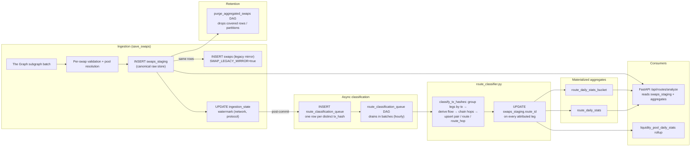
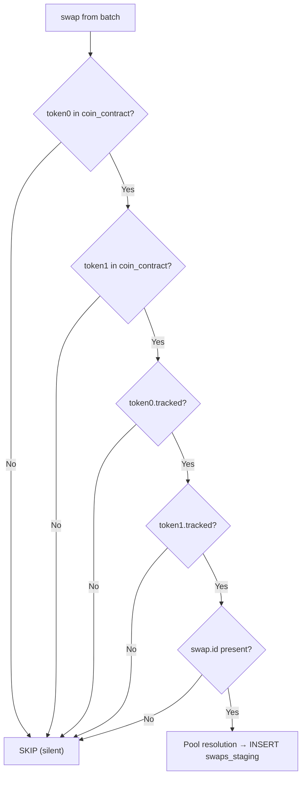
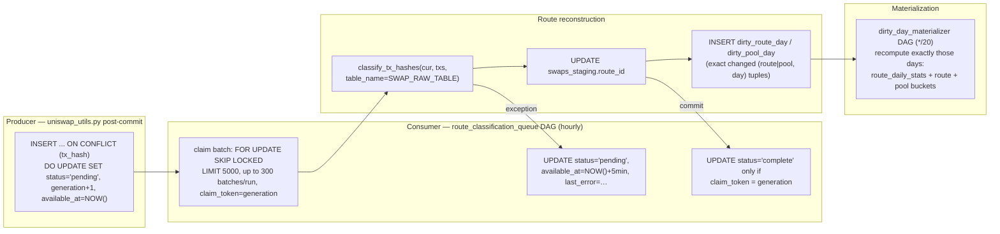
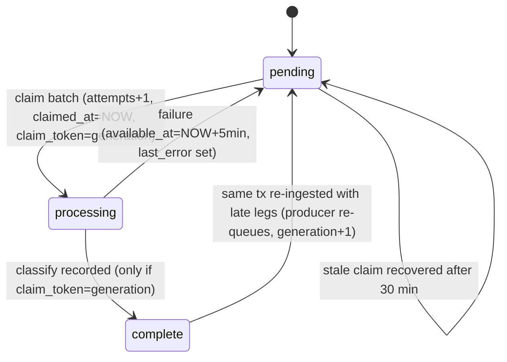

# Swap Ingestion Rules & Route Classification Pipeline

> **Source of truth**: `dags/common/utils/uniswap_utils.py` — `PostgresStorage.save_swaps`,
> plus the async classifier `include/route_classifier.py` and the
> `route_classification_queue` DAG.

---

## Overview

Swaps are ingested per-batch from The Graph subgraphs. Before any swap is written to
the raw store (`swaps_staging`), it must pass a series of token and pool validation
checks. If a matching pool does not yet exist, it is created on-the-spot. The whole
batch commits in a single transaction, then the transaction hashes are handed to an
asynchronous classification queue so route reconstruction never blocks ingestion.

### End-to-end pipeline



---

## Token Validation Rules

These checks run for **every swap** in the batch. A swap is **silently skipped** (no error) if any check fails.

### Rule 1 — Both token contract addresses must be known

The token lookup uses the **on-chain contract address** (lowercased), not the symbol. At the start of each batch, all rows from `coin_contract` for the target chain are loaded into a map:

```
LOWER(contract_address) → { coin_id, symbol, tracked }
```

If either `token0_address` or `token1_address` from the swap is **not present** in this map, the swap is **skipped**.

> This means: **only tokens whose contract address has been registered by CoinMarketCap** (via the `cmc_global_coin_metadata` DAG) will have their swaps ingested.

### Rule 2 — Both tokens must be tracked

Each entry in `coin_contract` has a `tracked` boolean (`DEFAULT TRUE`). If either token has `tracked = false`, the swap is **skipped**.

> Set `tracked = false` on a `coin_contract` row to suppress ingestion of all swaps involving that token, without removing it from the database.

### Rule 3 — Swap must have a valid ID

The subgraph swap `id` is required. If the `id` field is empty, the swap is skipped.



---

## Log Index Derivation

The `log_index` uniquely identifies a swap within a transaction (used as part of the `swaps_staging` primary key alongside `ts` and `tx_hash`).

| Subgraph ID format | Parsing strategy |
|---|---|
| `{tx_hash}#{index}` (V3 style) | Split on `#`, parse right part as integer |
| `{something}-{index}` (V4/fallback) | `rsplit('-', 1)`, parse right part as integer |
| Neither | Fallback: monotonically incrementing counter per `tx_hash` within the batch |

---

## Pool Resolution & Upsert

After token validation, `save_swaps` resolves the internal `liquidity_pool.id` for the swap using three strategies, in order:

```mermaid
flowchart TD
    P0["resolve pool_id for swap"] --> S1["Step 1: match by on-chain pool ID<br/>pool_id_map[sg_pool_id.lower()]"]
    S1 -->|"hit"| USE["use existing pool"]
    S1 -->|"miss"|     S2["Step 2: match by token pair + fee<br/>(chain_id, protocol_id, coin pair, fee_bps)"]
    S2 -->|"hit"| USE
    S2 -->|"miss"| S3["Step 3: INSERT liquidity_pool on-the-spot<br/>ON CONFLICT idx_liquidity_pool_canonical<br/>RETURNING id, then cache in-memory"]
    S3 --> USE
    USE --> B["append swap to batch insert"]
```

### Step 1 — Match by on-chain pool ID (`pool_address` / `pool_id`)

```
sg_pool_id = swap['pool']['id']   # subgraph pool contract address (V3) or poolId hash (V4)
pool_id = pool_id_map.get(sg_pool_id.lower())
```

The map is loaded once per batch from `liquidity_pool.pool_id` for all existing pools.

### Step 2 — Match by token pair + fee

If Step 1 misses (pool_id not in DB), fall back to matching on:

```
(chain_id, protocol_id, frozenset({coin0_id, coin1_id}), fee_bps)
```

This handles cases where the pool exists in DB but was inserted without a `pool_id` (e.g. seeded manually or from an older run).

### Step 3 — Create pool on-the-spot (upsert)

If neither step finds a match, a new `liquidity_pool` row is inserted:

```sql
INSERT INTO liquidity_pool (chain_id, protocol_id, pool_name, fee_bps, coin0_id, coin1_id, pool_address, reverted)
VALUES (...)
ON CONFLICT (chain_id, protocol_id, pool_name, fee_bps, COALESCE(pool_id, ''))
DO UPDATE SET pool_address = COALESCE(liquidity_pool.pool_address, EXCLUDED.pool_address)
RETURNING id
```

**Pool name** is auto-generated as: `{SYMBOL0}-{SYMBOL1} {fee_tier}` (e.g. `WETH-USDC 0.05%`)

**Conflict key**: `(chain_id, protocol_id, pool_name, fee_bps, COALESCE(pool_id, ''))` — the unique index `idx_liquidity_pool_canonical`.

**On conflict**: only `pool_address` is updated, and only if it was previously NULL (i.e. the address from the subgraph wins over NULL, but never overwrites an existing address). All other fields are left unchanged.

The newly created pool is **cached in-memory** for the remainder of the batch to avoid redundant DB round-trips.

---

## Swap Insert (Deduplication)

Once a valid `pool_id` is resolved, the swap is appended to the batch insert. The canonical write targets **`swaps_staging`** (partitioned by month); the legacy `swaps` table is mirrored only while `SWAP_LEGACY_MIRROR=true` so the running API keeps its raw-swap fallbacks during the transition.

```sql
-- Canonical raw store
INSERT INTO swaps_staging (tx_hash, log_index, ts, network, protocol, pool_id, amount0, amount1, amount_usd)
VALUES (...)
ON CONFLICT (ts, tx_hash, log_index) DO NOTHING;

-- Legacy mirror (only when SWAP_LEGACY_MIRROR=true)
INSERT INTO swaps (tx_hash, log_index, ts, pool_id, amount0, amount1, amount_usd)
VALUES (...)
ON CONFLICT (ts, tx_hash, log_index) DO NOTHING;
```

Duplicates (same `ts + tx_hash + log_index`) are silently ignored, making re-runs safe.

### Batch commit sequence

```mermaid
sequenceDiagram
    participant D as Ingestion DAG
    participant DB as Postgres
    participant Q as route_classification_queue
    participant W as Queue DAG (hourly)
    participant C as route_classifier.py

    D->>DB: executemany INSERT INTO swaps_staging ... ON CONFLICT DO NOTHING
    Note over D,DB: same rows mirrored into `swaps` if SWAP_LEGACY_MIRROR=true
    D->>DB: UPDATE ingestion_state (watermark GREATEST last_ts)
    D->>DB: COMMIT (whole batch)
    D->>Q: INSERT ... ON CONFLICT (tx_hash) DO UPDATE SET status='pending',<br/>generation = generation + 1 (one row per distinct tx_hash)
    loop drain (up to 300 × 5000 txs per run)
        W->>Q: claim batch FOR UPDATE SKIP LOCKED → status='processing',<br/>claim_token = generation
        W->>C: classify_tx_hashes(tx_hashes, table_name='swaps_staging')
        C->>DB: upsert origin_destination_pair / route / route_hop
        C->>DB: UPDATE swaps_staging SET route_id ... for each leg
        W->>DB: INSERT dirty_route_day / dirty_pool_day (exact changed day tuples)
        W->>Q: status='complete' ONLY WHERE claim_token = generation<br/>(or retry w/ 5min backoff on failure)
    end
    Note over W,C: No broad recompute here; dirty_day_materializer consumes<br/>the dirty tables and recomputes exactly those days.
```

---

## Asynchronous Route Classification

Route reconstruction is deliberately **decoupled** from ingestion. `save_swaps` only
enqueues the distinct transaction hashes of the committed batch; a worker DAG drains
that queue, so Graph ingestion never blocks on route-dimension upserts and a large
historical backfill can enqueue millions of hashes without contending with live
ingestion callbacks.

### Work queue (`route_classification_queue`)



### Queue status machine



> A tx whose legs span multiple protocols lands in different ingestion batches; the
> producer re-queues it (`ON CONFLICT` → `status='pending'`, `generation+1`) whenever
> late legs arrive, so the route is reclassified until complete. Because completion is
> conditional on `claim_token = generation`, a worker that classified an older value can
> never overwrite a newer requeue.

### Classification steps (`include/route_classifier.py`)

1. **Group legs by tx hash**, order by `log_index`.
2. **Derive per-leg flow** from the sign of `amount0`/`amount1`: the positive amount is spent, the negative is received (input token = token on the positive side).
3. **Chain contiguous legs** so hop `N`'s output == hop `N+1`'s input; disjoint swaps in one tx produce separate chains (each becomes its own route). Round-trips (origin == dest) are valid.
4. **Upsert** `origin_destination_pair` on `(chain_id, origin_contract, dest_contract)`, then `route` on `canonical_key`; insert `route_hop` rows. This may use the set-based batch path (`collect_route_staging` + `merge_route_staging`, optionally parallel) instead of per-tx upserts.
5. **Attribute swaps**: set `swaps_staging.route_id` for each leg.
6. **Record dirty work**: the classifier writes the exact changed `(route_id, day)` / `(pool_id, day)` tuples into `dirty_route_day` / `dirty_pool_day`. `dirty_day_materializer` recomputes exactly those days (`DELETE + INSERT` is idempotent) — no broad contiguous recompute.

### DAGs in the pipeline

| DAG | Schedule | Role |
|---|---|---|
| `route_classification_queue` | hourly | Drains the queue in batches (up to 300 × 5000/run), classifies, records `dirty_route_day`/`dirty_pool_day`. `max_active_runs=1`, stale-claim recovery after 30 min, retries with 5 min backoff |
| `dirty_day_materializer` | every 20 min | Consumes the dirty tables and recomputes **exactly** those days (`route_daily_stats`, `route_daily_stats_bucket`, `liquidity_pool_daily_stats_bucket`) |
| `route_daily_stats_rollup` | hourly | Safety-net recompute of the recent window (default 3 days) for `route_daily_stats`, `route_daily_stats_bucket`, and `liquidity_pool_daily_stats_bucket` |
| `global_liquidity_pool_daily_stats_rollup` | daily 2 AM | Reads `swaps_staging` to materialize `liquidity_pool_daily_stats` + `liquidity_pool_daily_stats_bucket` |
| `purge_aggregated_swaps` | opt-in | **Opt-in** (`RAW_SWAP_PURGE_ENABLED=true`) purge of `swaps_staging` rows once covered by aggregates; drops empty monthly partitions |

---

## Switchover note (2026-08)

`swaps_staging` is now the canonical short-lived raw store. Ingestion cursors read
`ingestion_state.last_ts` instead of `MAX(swaps.ts)`. The classifier,
`route_daily_stats` rollup, distribution buckets, and the global pool-history rollup
all read `swaps_staging` (via `SWAP_RAW_TABLE`). The legacy `swaps` table is only
mirrored during the transition (`SWAP_LEGACY_MIRROR=true` default) so the running API
raw-swap fallbacks keep working; flip it to `false` after those consumers are
migrated, then retire the table via the purge DAG.

---

## Ops cheat sheet

| Goal | How |
|---|---|
| Track a new token | Run `cmc_global_coin_metadata` DAG — it populates `coin_contract` with the CMC-verified address |
| Stop ingesting swaps for a token | `UPDATE coin_contract SET tracked = false WHERE contract_address = '0x...'` |
| Re-enable a token | `UPDATE coin_contract SET tracked = true WHERE contract_address = '0x...'` |
| Add a coin family / new coin | Add to `coin-families.yml`, run the CMC metadata DAG |
| Drain a backlog of tx hashes | Trigger `route_classification_queue` (or run `backfill_route_tables.py` for historical ranges) |
| Recompute recent route stats | Trigger `route_daily_stats_rollup` with `--conf '{"backfill_days": 90}'` |
| Free raw-store space | Enable `RAW_SWAP_PURGE_ENABLED=true` on `purge_aggregated_swaps` |
