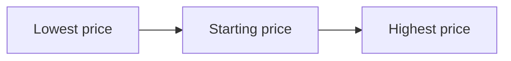
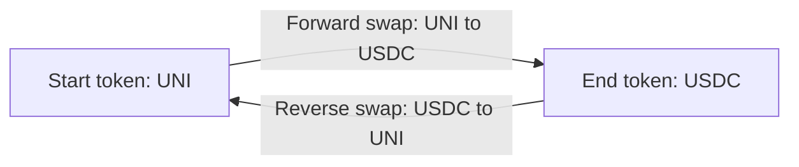
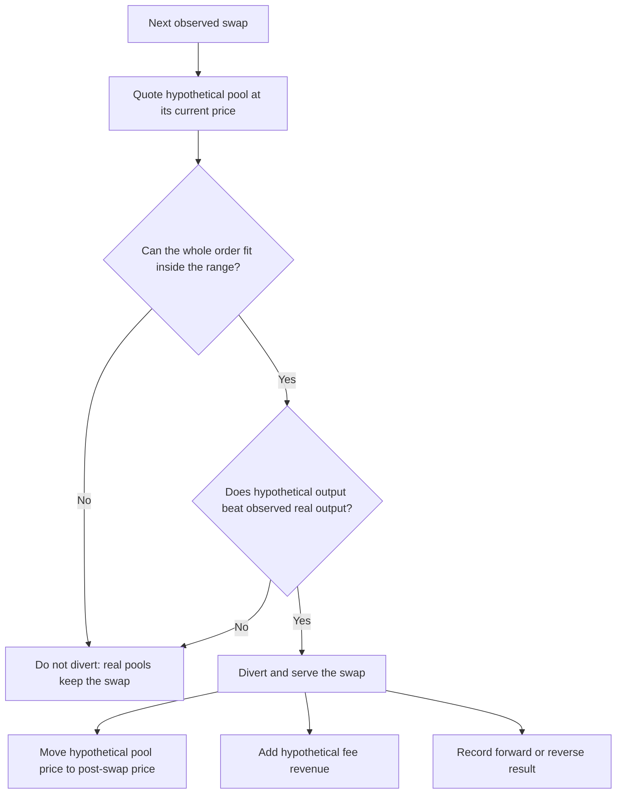
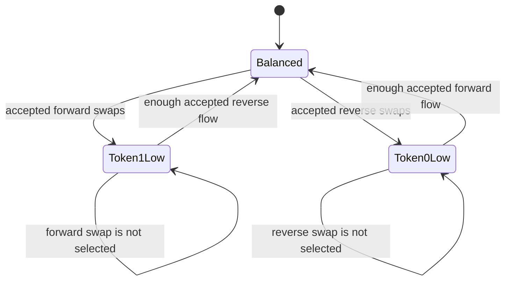
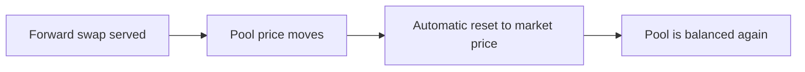
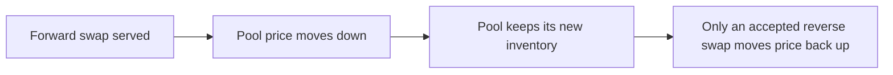
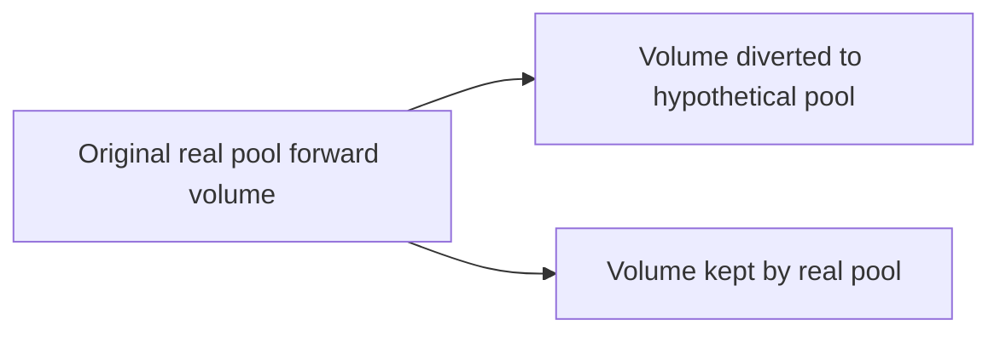
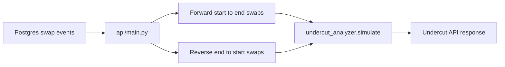

# Undercut Simulator

The undercut simulator answers one question:

> If a new concentrated-liquidity pool existed for this pair, which observed
> swaps would route through it, how would its inventory change, and what fee
> APR could it earn?

It is used by `GET /api/routes/undercut` and implemented in
`api/routing/undercut_analyzer.py`.

The simulator uses real historical swap events. It does **not** invent an
arbitrage trade after every swap. That is the important difference from a
simple market-price model.

## Quick Example

Assume a hypothetical `UNI / USDC` pool:

| Setting | Example value |
|---|---:|
| Total liquidity | $100,000 |
| Initial price | 10 USDC per UNI |
| Range | 10% |
| Hypothetical fee | 0.30% |
| Pool token0 | UNI (the start token) |
| Pool token1 | USDC (the end token) |

The endpoint uses a $50,000-per-token sizing target for the position. The V3
liquidity amount `L` is then limited by whichever side supports less liquidity
at the configured price and range.



Read the graph from left to right:

| Marker | Plain meaning | UNI/USDC example with a 10 USDC/UNI opening price and 10% range |
|---|---|---:|
| `sa` | Lowest price where this LP position has liquidity | 9.09 USDC per UNI |
| `s_open` | Price at which the hypothetical pool begins the simulation | 10.00 USDC per UNI |
| `sb` | Highest price where this LP position has liquidity | 11.00 USDC per UNI |

`sa` and `sb` are internal names inherited from Uniswap V3 math. The code uses
the square root of each price, but the simulator documentation uses normal token
prices because they are easier to read.

`L` is the single concentrated-liquidity amount available between `sa` and
`sb`; it is not another price marker.

For a 10 USDC/UNI opening price and a 10% range, the band is approximately:

```text
9.09 USDC/UNI              10.00 USDC/UNI              11.00 USDC/UNI
lower boundary                 opening price                 upper boundary
```

## The Two Directions

The endpoint fetches real demand in both directions.



| Direction | User gives the pool | User receives | Pool price moves | What the pool loses |
|---|---|---|---|---|
| Forward | token0 / UNI | token1 / USDC | Down, toward `sa` | USDC |
| Reverse | token1 / USDC | token0 / UNI | Up, toward `sb` | UNI |

Forward swaps are the rows and totals shown in the undercut table. Reverse
swaps are also simulated because they are the real counter-flow that can refill
the hypothetical pool.

## What Happens To Each Swap

The simulator merges forward and reverse swaps by timestamp. It processes them
one at a time, using the pool's **current internal price**, not the current
market price.



A swap is diverted only when both conditions are true:

1. The hypothetical pool can fill the **entire** order without reaching its
   range boundary.
2. Its simulated output is larger than the output the real pool produced for
   that observed swap.

If either condition fails, the real pools keep the swap and the hypothetical
pool is unchanged.

## Worked Inventory Example

The numbers below are deliberately rounded to make the flow understandable.
The implementation uses exact-in Uniswap V3 integer math in
`compute_swap_step`.

Initial state:

```text
Price: 10.00 USDC per UNI
Inventory: balanced
Pool can serve both directions
```

| Time | Observed demand | Hypothetical result | New pool state |
|---|---|---|---|
| 1 | User sells UNI for USDC | Pool gives a better USDC output, so it serves the forward swap | More UNI, less USDC; price moves down |
| 2 | More users sell UNI for USDC | More forward swaps are served | Even more UNI, even less USDC; price moves closer to `sa` |
| 3 | Another large UNI to USDC swap | It would consume the remaining USDC and hit `sa`, so it is not diverted | Pool remains USDC-poor; real pools serve this swap |
| 4 | User sells USDC for UNI | Pool is UNI-rich, gives a strong UNI output, and serves the reverse swap | More USDC, less UNI; price moves back up |
| 5 | Later UNI to USDC swap | Pool may again beat the real route and serve it | Inventory continues to evolve from the new price |

The important behavior is at time 3: the pool is **not reset to market price**.
It stays USDC-poor until real reverse demand reaches it.

## Inventory States



This is why the simulator is called a **two-sided inventory model**:

- Repeated forward flow makes the pool low on token1.
- Repeated reverse flow makes the pool low on token0.
- Real flow in the opposite direction is what restores usable inventory.

## Why This Is Not A Market-Anchored Simulation

In a market-anchored model, the pool is silently reset to the current market
price after every served swap:



That makes a one-sided pool look unrealistically healthy because it never runs
out of the output token.

The undercut simulator intentionally does this instead:



## Fees And APR

For every diverted swap, the simulator estimates fee revenue as:

```text
swap fee in USD = observed swap USD value x hypothetical fee_pips / 1,000,000
```

Both directions count toward hypothetical-pool fees:

```text
total hypothetical fees = forward diverted fees + reverse diverted fees

APR percent = total hypothetical fees / liquidity_usd x 365 / days x 100
```

Example: a 0.30% hypothetical fee is `3,000 fee_pips`. A served $10,000 swap
adds approximately `$10,000 x 3,000 / 1,000,000 = $30` in fees.

## Results Returned By The Endpoint

| Field | Simple meaning |
|---|---|
| `diverted_count` / `diverted_volume` | Forward swaps and forward USD volume captured by the hypothetical pool |
| `reverse_count` / `reverse_volume` | Reverse swaps and reverse USD volume served to rebalance the pool |
| `fee_usd` | Estimated hypothetical fees from **both** directions |
| `reverse_fee_usd` | The reverse-direction portion of `fee_usd` |
| `apr_pct` | Annualized hypothetical fee return on `liquidity_usd` |
| `diverted_pct` | Share of forward volume captured by the hypothetical pool |
| `by_pool` | Forward diversion by real pool; used to calculate each real pool's remaining volume |
| `in_range` | Diagnostic count of events encountered while the simulated price was strictly inside the configured band |
| `L` | Concentrated-liquidity amount used by the V3 math |

The hypothetical summary is deliberately asymmetric:

```text
Forward diversion fields: used by the visible start-to-end table.
Reverse fields: show the counter-flow used for inventory and fee APR.
fee_usd and apr_pct: include both directions.
```

## How The Real Pool Rows Reconcile

For the start-to-end table only:



The endpoint preserves this conservation rule:

```text
sum of displayed real pool counts
= sum of displayed post-simulation pool counts + hypothetical diverted_count
```

Reverse swaps do not alter these forward table totals. They only affect the
hypothetical pool's inventory and two-sided fee revenue.

## Important Boundaries Of The Model

| The simulator does | The simulator does not |
|---|---|
| Uses observed historical direct-pair swap demand | Invent arbitrage trades or reset the pool after a swap |
| Uses exact-in V3 swap-step math for hypothetical quotes | Partially fill an order that reaches the range boundary |
| Requires hypothetical output to beat observed real output | Assume every available swap is diverted |
| Tracks price and inventory composition through time | Model gas cost, MEV competition, or a multi-pool route that includes the hypothetical pool |

## Implementation Map



- `api/main.py` prepares and deduplicates the forward and reverse event streams.
- `undercut_analyzer.py` builds the hypothetical range, evaluates each quote,
  tracks the drifted price, and returns diversion and fee statistics.
- `test_undercut_analyzer.py` covers drain behavior, rebalancing, rejected
  non-competitive swaps, two-sided fee revenue, and initial pool setup.

## Run The Tests

```bash
cd api/routing
python3 test_undercut_analyzer.py
```
