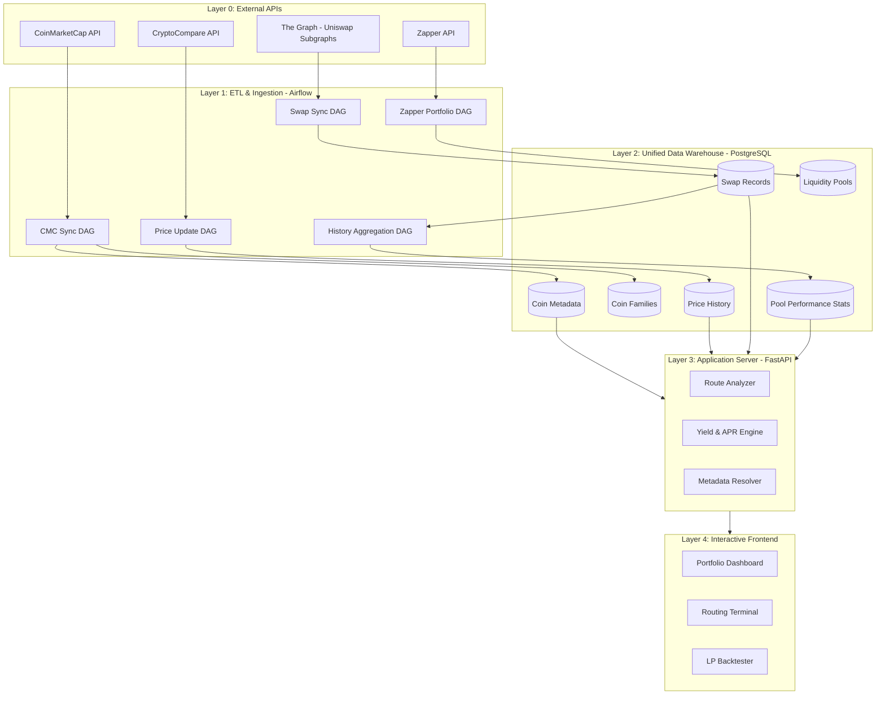

# System Architecture: Chaintelligence

Chaintelligence is a comprehensive DeFi analytics platform designed to provide real-time portfolio tracking, route analysis for token swaps, and historical backtesting for Uniswap V3 liquidity positions.

## 📊 System Architecture Diagram

## 🏗️ High-Level Component Overview

The system follows a strict **N-Tier Architecture**, where the Presentation Layer is fully decoupled from data storage and external providers. All client requests are mediated by the Logic Layer (FastAPI), ensuring centralized authentication, rate limiting, and data normalization.

### 1. Unified Data Warehouse (PostgreSQL)

The central source of truth for all indexed blockchain and off-chain data.

- **Relational Model**: Optimized for cross-referencing on-chain positions with market metadata.
- **Key Tables**:
  - `coin`: Metadata for tracked cryptocurrencies (CMC rank, contract addresses, etc.).
  - `coin_family`: Many-to-many mapping for grouped assets (e.g., USD family, BTC family).
  - `liquidity_pool`: Registry of standardized Uniswap V3 and DeFi pools.
  - `liquidity_pool_position`: Current active LP positions across tracked wallets.
  - `uniswap_v3_swaps`: Historical transactional data used for volume and yield analysis.
  - `coin_price_history`: Multi-year time-series price data.

**See the [Detailed Database Schema](../chain-feeder/docs/SCHEMA.md) for table definitions and relational constraints.**

### 2. ETL & Ingestion Layer (Apache Airflow)

Automated pipelines (DAGs) responsible for keeping the Data Warehouse in sync with the physical world.

- **cmc_coin_map_sync**: Discovers new tokens and updates market rankings from CoinMarketCap.
- **zapper_lp_ingestion**: Regularly fetches active portfolio data from Zapper for a set of target addresses.
- **the_graph_uniswap_v3_swaps**: Successive indexing of on-chain swap events from The Graph.
- **coin_price_update**: High-frequency price updates and a graduated historical backfill system:
  - **Top 100 Coins**: Full historical depth.
  - **Coins 100-1000**: Rolling 2-year window.
- **uniswap_v3_history_sync**: Periodically aggregates millions of swap records into daily pool statistics (volumes, APRs).

### 3. Application Server (FastAPI) - "The Logic Layer"

The exclusive gateway for all frontend interaction.

- **Route Analyzer**: Implements complex graph-walking logic to find optimal swap paths using historical execution data.
- **Yield Engine**: Calculates APRs based on realized fee accumulation vs. TVL.
- **Metadata Resolver**: Normalizes user input (e.g., resolving a family like "USD" into its components like USDC/USDT/DAI).
- **Security & Proxying**: Mediates access to internal data and proxies external metadata (like coin rankings) to avoid direct client-side external dependencies.

### 4. Interactive Frontend - "The Presentation Layer"

A modern web-based interface for data visualization. **Strictly limited to API communication.**

- **Route Analysis Terminal**: Visualizes swap paths, market sizes, and execution counts.
- **Portfolio Dashboard**: Displays active LP positions with real-time range monitoring.
- **LP Backtester**: A standalone simulator for testing Uniswap V3 strategies against historical price volatility.

---

## 🛰️ Integration Points

Chaintelligence integrates with several key infrastructure providers via the **Ingestion Layer** (for bulk data) or **Logic Layer** (for just-in-time metadata):

- **CoinMarketCap**: Source for authoritative token discovery, rankings, and Ethereum contract addresses.
- **CryptoCompare**: Provides sub-minute price data and long-form historical OHLCV data.
- **The Graph**: Used for querying distributed ledger events (Uniswap V3 subgraphs).
- **Zapper**: Leveraged for cross-protocol portfolio tracking and position identification.

---

## ⚡ Reliability & Performance Patterns

- **API Batching**: Outbound requests to providers (like CryptoCompare) are automatically batched (e.g., 50 symbols per batch) to maximize throughput and avoid URL limit constraints.
- **Database Triggers**: Automatic normalization (e.g., forcing uppercase symbols) via PL/pgSQL triggers ensures data consistency regardless of the ingestion source.
- **Asset-Based Scheduling**: Airflow tasks are linked via Assets/Datasets to ensure downstream daily history aggregations only run when the raw swap data is ready.
- **Micro-Batch Processing**: Large-scale swap analysis is chunked by time-windows to maintain responsive API performance under load.
- **Presentation Decoupling**: Frontend components never maintain direct connections to PostgreSQL or external data providers, ensuring a secure and manageable "Logic Gateway" pattern.
