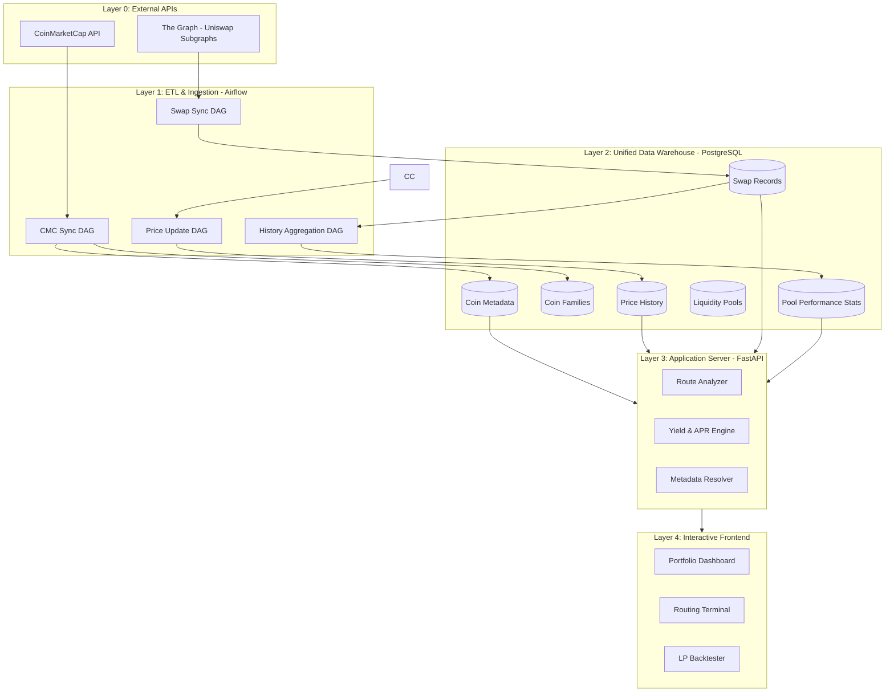

# System Architecture: Chaintelligence

Chaintelligence is a comprehensive DeFi analytics platform designed to provide real-time portfolio tracking, route analysis for token swaps, and historical backtesting for Uniswap V3 liquidity positions.

## 📁 Repository Structure

The codebase is organized into distinct layers that mirror the architectural tiers:

```text
chaintelligence/
├── api/                          # Layer 3: Application Server (FastAPI)
│   ├── main.py                   # API routes, authentication, business logic
│   ├── requirements.txt          # Python dependencies
│   └── tests/                    # API integration tests
│       ├── test_api.py           # Automated endpoint validation
│       └── README.md             # Testing documentation
│
├── web/                          # Layer 4: Presentation Layer
│   ├── static/                   # Main portal UI assets
│   │   ├── index.html            # Landing page
│   │   ├── routing.html          # Route Analysis Terminal
│   │   ├── lp.html               # Portfolio Dashboard
│   │   ├── app.js                # Route analysis logic
│   │   ├── lp.js                 # Portfolio rendering
│   │   ├── style.css             # Unified styling
│   │   └── nav.js                # Navigation component
│   └── backtest/                 # LP Backtester (standalone app)
│       ├── index.html            # Backtester UI
│       ├── logic.js              # Strategy simulation engine
│       └── docs/                 # Strategy documentation
│
├── chain-feeder/                 # Layer 1: ETL & Ingestion (Airflow)
│   ├── dags/                     # Airflow DAG definitions
│   │   ├── cmc_coin_map_sync.py

│   │   ├── the_graph_uniswap_v3_swaps_dag.py
│   │   └── uniswap_v3_history_sync.py
│   ├── routing/                  # Shared business logic
│   │   ├── postgres_fetcher.py   # Database abstraction
│   │   ├── route_analyzer.py     # Graph-walking algorithms
│   │   └── config.py             # Connection strings
│   └── include/
│       ├── sql/init_db.sql       # Schema definitions
│       └── scripts/              # Utility scripts
│
├── docs/                         # Documentation
│   └── architecture.md           # This file
│
├── docker-compose.yaml           # Container orchestration
├── Dockerfile                    # API server image
└── .env                          # Environment configuration
```

### Key Organizational Principles

1. **API Layer (`api/`)**: Contains all server-side logic, authentication, and database interaction. This is the exclusive gateway for frontend requests.

2. **Web Layer (`web/`)**: Strictly presentation-focused. All components communicate exclusively with the API layer via HTTP. No direct database or external API access.

3. **Chain Feeder (`chain-feeder/`)**: Autonomous data ingestion pipelines. Operates independently from the web application, ensuring data freshness without blocking user interactions.

4. **Shared Logic (`chain-feeder/routing/`)**: Business logic modules (like `RouteAnalyzer`) are imported by both Airflow DAGs and the FastAPI server, ensuring consistency between batch processing and real-time queries.

## 📊 System Architecture Diagram



## 🏗️ High-Level Component Overview

The system follows a strict **N-Tier Architecture**, where the Presentation Layer is fully decoupled from data storage and external providers. All client requests are mediated by the Logic Layer (FastAPI), ensuring centralized authentication, rate limiting, and data normalization.

### 1. Unified Data Warehouse (PostgreSQL)

The central source of truth for all indexed blockchain and off-chain data.

- **Relational Model**: Optimized for cross-referencing on-chain positions with market metadata.
- **Key Tables**:
  - `coin`: Metadata for tracked cryptocurrencies (CMC rank, contract addresses, etc.).
  - `coin_family`: Many-to-many mapping for grouped assets (e.g., USD family, BTC family).
  - `liquidity_pool`: Registry of standardized Uniswap V3 and DeFi pools.
  - `liquidity_pool_position`: Current active LP positions across tracked wallets.
  - `uniswap_v3_swaps`: Historical transactional data used for volume and yield analysis.
  - `coin_price_history`: Multi-year time-series price data.

**See the [Detailed Database Schema](../chain-feeder/docs/SCHEMA.md) for table definitions and relational constraints.**

### 2. ETL & Ingestion Layer (Apache Airflow)

Located in `chain-feeder/dags/`, automated pipelines (DAGs) are responsible for keeping the Data Warehouse in sync with the physical world.

- **cmc_coin_map_sync**: Discovers new tokens and updates market rankings from CoinMarketCap.
- **graph_lp_ingestion**: Regularly fetches active portfolio data natively from The Graph for a set of target addresses.
- **the_graph_uniswap_v3_swaps**: Successive indexing of on-chain swap events from The Graph.
- **coin_price_update**: High-frequency price updates and a graduated historical backfill system:
  - **Top 100 Coins**: Full historical depth.
  - **Coins 100-1000**: Rolling 2-year window.
- **uniswap_v3_history_sync**: Periodically aggregates millions of swap records into daily pool statistics (volumes, APRs).

### 3. Application Server (FastAPI) - "The Logic Layer"

Located in `api/main.py`, this is the exclusive gateway for all frontend interaction.

- **Route Analyzer**: Implements complex graph-walking logic to find optimal swap paths using historical execution data.
- **Yield Engine**: Calculates APRs based on realized fee accumulation vs. TVL.
- **Metadata Resolver**: Normalizes user input (e.g., resolving a family like "USD" into its components like USDC/USDT/DAI).
- **Security & Proxying**: Mediates access to internal data and proxies external metadata (like coin rankings) to avoid direct client-side external dependencies.
- **Authentication**: HTTP Basic Auth middleware protects sensitive endpoints while allowing public access to metadata APIs.

**API Endpoints:**

- `/api/routes/analyze` - Route analysis with APR enrichment
- `/api/routes/date-range` - Available swap data timeframe
- `/api/lp/position-summary` - Aggregated LP portfolio snapshots
- `/api/coin/list` - Token metadata (public)
- `/api/coin/price-history` - Historical price data (public)

### 4. Interactive Frontend - "The Presentation Layer"

Located in `web/`, a modern web-based interface for data visualization. **Strictly limited to API communication.**

- **Route Analysis Terminal** (`web/static/routing.html`): Visualizes swap paths, market sizes, execution counts, and APR metrics with interactive tooltips.
- **Portfolio Dashboard** (`web/static/lp.html`): Displays active LP positions with real-time range monitoring, fee accrual tracking, and multi-wallet filtering.
- **LP Backtester** (`web/backtest/`): A standalone simulator for testing Uniswap V3 strategies against historical price volatility with multiple rebalancing strategies.

**Frontend Architecture:**

- Pure HTML/CSS/JavaScript (no build step required)
- Modular component design with shared navigation (`nav.js`)
- Version-controlled cache busting for CSS/JS assets
- Responsive design with glassmorphism UI patterns

---

## 🛰️ Integration Points

Chaintelligence integrates with several key infrastructure providers via the **Ingestion Layer** (for bulk data) or **Logic Layer** (for just-in-time metadata):

- **CoinMarketCap**: Source for authoritative token discovery, rankings, and Ethereum contract addresses.
- **The Graph**: Used for querying distributed ledger events (Uniswap V3 subgraphs).


---

## ⚡ Reliability & Performance Patterns

- **API Batching**: Outbound requests to providers are automatically batched (e.g., 50 symbols per batch) to maximize throughput and avoid URL limit constraints.
- **Database Triggers**: Automatic normalization (e.g., forcing uppercase symbols) via PL/pgSQL triggers ensures data consistency regardless of the ingestion source.
- **Asset-Based Scheduling**: Airflow tasks are linked via Assets/Datasets to ensure downstream daily history aggregations only run when the raw swap data is ready.
- **Micro-Batch Processing**: Large-scale swap analysis is chunked by time-windows to maintain responsive API performance under load.
- **Presentation Decoupling**: Frontend components never maintain direct connections to PostgreSQL or external data providers, ensuring a secure and manageable "Logic Gateway" pattern.
- **Stateless API Design**: The FastAPI server is fully stateless, enabling horizontal scaling and simplified container orchestration.

---

## 🔒 Security Architecture

- **Authentication Middleware**: HTTP Basic Auth protects all sensitive endpoints while allowing public access to metadata APIs.
- **Environment-Based Secrets**: All API keys and credentials are managed via environment variables, never committed to version control.
- **CORS & Rate Limiting**: Configured at the FastAPI layer to prevent abuse and unauthorized access.
- **Docker Network Isolation**: Services communicate via internal Docker networks, with only necessary ports exposed to the host.

---

## 🟦 Base Chain / Aerodrome Support

Aerodrome is supported as a **protocol on the Base network** (`network='Base'`, `protocol='Aerodrome'`), not as a separate chain. Because the routing layer keys chain by the `network` string column (there is no `chain_id`), no new chain plumbing is required — Aerodrome swaps flow through the same unified `swaps` table and `postgres_fetcher` query as every other protocol.

**Scope — Slipstream only.** The live, queryable Aerodrome swaps subgraph on The Graph Decentralized Network (`GENunSHWLBXm59mBSgPzQ8metBEp9YDfdqwFr91Av1UM`) is the **Slipstream** concentrated-liquidity fork (a Uniswap V3 clone). Its swap schema is V3-identical (`id`=`{tx}#{logIndex}`, `token0/1`, `amount0/1`, `amountUSD`, `pool{feeTier}`), so `UniswapV3Fetcher` is reused unchanged — only the subgraph deployment ID differs (branch in `chain-feeder/dags/common/utils/uniswap_utils.py`). The Aerodrome V1 (Velodrome-fork stable/volatile) subgraph is not on this gateway and is **out of scope**; add it later by extending the fetcher if/when its deployment is located.

**Ingestion.** A `fetch_and_store_aerodrome_swaps` task in `the_graph_uniswap_v3_swaps.py` DAG fetches nightly and checkpoints against `MAX(ts) FROM swaps WHERE network='Base' AND protocol='Aerodrome'`. Initial three-day backfill = trigger the DAG with conf `{"backfill_days":{"Base_Aerodrome":3}}` (no separate backfill DAG).

**Pool addresses — subgraph-sourced, not CREATE2-derived.** Aerodrome Slipstream pools are created by their own CL PoolDeployer (not the Uniswap V3 factory), so `api/main.py`'s `_derive_address` CREATE2 path does not apply. The enrichment loop **skips** `protocol='Aerodrome'` pools (mirrors the V4 skip). Pool cards still render from swap data; APR/address enrichment for Aerodrome is a follow-up.

**Token registry.** AERO/USDT/WBTC on Base are seeded via `chain-feeder/include/sql/add_aerodrome_base_tokens.sql` (addresses verified against the subgraph). Without this, `PostgresStorage.save_swaps` drops AERO-pair swaps (symbol not in `SYMBOL_TO_COIN_ID`).
