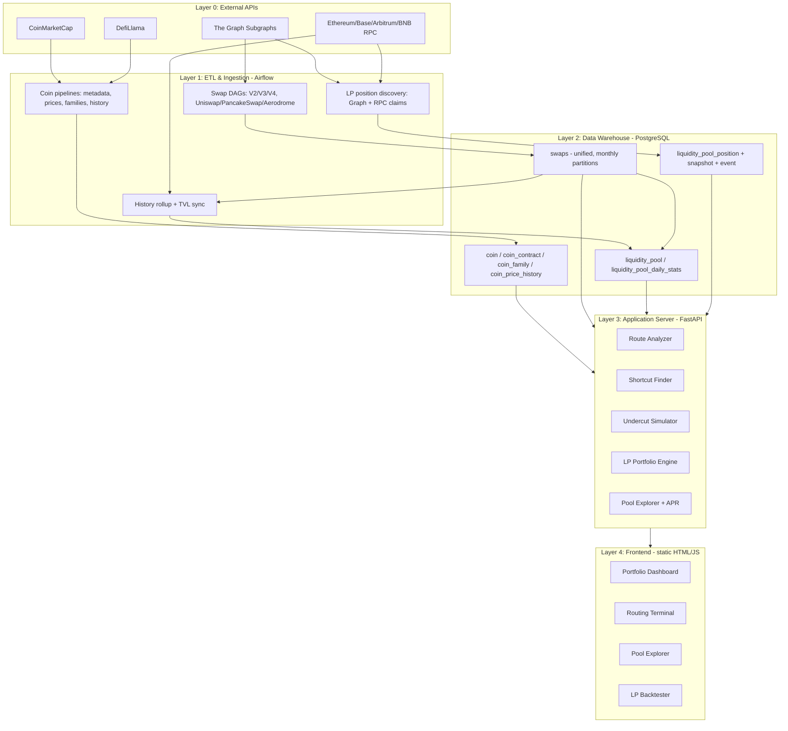

# System Architecture: Chaintelligence

Chaintelligence is a DeFi analytics platform: real-time LP portfolio tracking, swap-route analysis (including the undercut simulator and stable-pair shortcut finder), and historical backtesting for Uniswap V3 liquidity positions.

It is an **N-tier system**: Airflow ETL → PostgreSQL warehouse → FastAPI logic layer → static HTML/JS frontend. The frontend **never** touches Postgres or external APIs directly; it only talks to the FastAPI layer.

## Repository Structure

The codebase is organized into layers that mirror the architectural tiers:

```text
chaintelligence/
├── api/                          # Layer 3: Application Server (FastAPI)
│   ├── main.py                   # Entire FastAPI app: routes, auth, business logic
│   ├── routing/                  # Analysis core owned by the API layer
│   │   ├── postgres_fetcher.py   # Warehouse queries (unified `swaps` table)
│   │   ├── route_analyzer.py     # Multi-hop route reconstruction
│   │   ├── shortcut_finder.py    # Stable-pair shortcut opportunity scanner
│   │   ├── undercut_analyzer.py  # Hypothetical narrow-range pool simulator
│   │   ├── uniswap_fetcher.py    # Subgraph fetch + normalization
│   │   ├── aggregator.py         # CLI aggregation helpers
│   │   ├── config.py             # API-layer config (tokens, subgraph, DSN)
│   │   ├── main.py               # Routing aggregation CLI
│   │   ├── find_shortcuts.py     # Shortcut-finder CLI
│   │   ├── check_token_aprs.py   # APR sanity-check CLI
│   │   └── test_*.py             # Plain-runner unit tests (no pytest)
│   ├── list_revert_links.py      # Revert subgraph URL helper
│   ├── requirements.txt
│   └── tests/                    # API integration tests (server must be running)
│       └── test_api.py
│
├── web/                          # Layer 4: Presentation Layer (no build step)
│   ├── static/                   # Main portal
│   │   ├── routing.html + app.js # Route analysis terminal
│   │   ├── lp.html + lp.js       # Portfolio dashboard
│   │   ├── pool.html + pool.js   # Pool explorer
│   │   ├── health.html + health.js # System health page
│   │   ├── api.html              # API reference
│   │   ├── nav.js                # Shared navigation
│   │   └── style.css             # Unified styling
│   └── backtest/                 # Standalone LP backtester (mounted at /backtester)
│       ├── index.html, app.js, logic.js, style.css
│       └── docs/                 # Strategy documentation
│
├── chain-feeder/                 # Layer 1: ETL & Ingestion (Airflow). ETL-only.
│   ├── dags/                     # Airflow DAGs (ingestion pipelines)
│   │   └── common/utils/config.py  # ETL-side config (DSN, token registry)
│   ├── include/                  # Shared, layer-agnostic infrastructure
│   │   ├── settings.py           # Shared DSN derivation (single source of truth)
│   │   ├── coin_family_resolver.py
│   │   ├── coinmarketcap_client.py
│   │   ├── defillama_client.py
│   │   ├── graph_discovery_client.py
│   │   ├── rpc_discovery_engine.py
│   │   ├── uniswap_v3_range_fetcher.py / uniswap_v4_range_fetcher.py / v4_pool.py
│   │   ├── v4_tvl_fetcher.py
│   │   ├── sql/                  # Warehouse schema + migrations
│   │   │   ├── init_db.sql
│   │   │   └── *.sql             # Incremental migrations
│   │   └── scripts/              # One-off/backfill scripts (run from shell)
│   └── docs/                     # ETL-only docs
│       ├── DAGS.md, SCHEMA.md, SWAP_INGESTION.md
│
├── config/                       # Per-network YAML config (mounted in both containers)
│   ├── dex-config.yaml           # DEX factory addresses + init-code hashes
│   ├── chains.yaml
│   ├── coin-families.yml
│   ├── manual-contracts.yaml
│   └── swap-retention.yaml
│
├── docs/                         # Business/architecture docs
│   ├── architecture.md           # This file
│   ├── concepts/                 # e.g. stable-pair-shortcut.md
│   ├── features/                 # PRDs & feature notes
│   ├── UNDERCUT_SIMULATOR.md
│   └── stable-pair-finder_plan.md
│
├── docker-compose.yaml           # Postgres + Airflow + server orchestration
├── Dockerfile                    # chaintelligence-server image
├── .env.config                   # Public, tracked env tuning
└── .env.secrets                  # Gitignored secrets (copy from .env.secrets.example)
```

### Key Organizational Principles

1. **API Layer (`api/`)**: Contains all server-side logic, authentication, and database interaction. This is the exclusive gateway for frontend requests. It owns the analytics/business logic in `api/routing/` (route analyzer, shortcut finder, undercut simulator, postgres fetcher).

2. **Web Layer (`web/`)**: Strictly presentation-focused. All components communicate exclusively with the API layer via HTTP. No direct database or external API access.

3. **Chain Feeder (`chain-feeder/`)**: Autonomous data ingestion (ETL) pipelines, independent from the web app. It does **not** own analytics/business logic — it only fetches, normalizes, and stores. Analysis code lives in `api/routing/`, shared only with Airflow via the `include/` namespace (e.g. `v4_pool`, `settings`).

4. **Shared configuration (`config/` + `include/`)**: Per-network DEX config lives in `config/dex-config.yaml`, read by `api/main.py` and `api/routing/postgres_fetcher.py`. Connection-string derivation for the warehouse is centralized in `chain-feeder/include/settings.py` (`data_warehouse_dsn`), imported by both the API and ETL configs so env handling never drifts.

## System Architecture Diagram


```mermaid
graph TD
    subgraph Layer0 [Layer 0: External APIs]
        CMC[CoinMarketCap]
        DL[DefiLlama]
        TG[The Graph Subgraphs]
        RPC[Ethereum/Base/Arbitrum/BNB RPC]
    end

    subgraph Layer1 [Layer 1: ETL & Ingestion - Airflow]
        DAG_COIN[Coin pipelines: metadata, prices, families, history]
        DAG_SWAP[Swap DAGs: V2/V3/V4, Uniswap/PancakeSwap/Aerodrome]
        DAG_HIST[History rollup + TVL sync]
        DAG_LP[LP position discovery: Graph + RPC claims]
    end

    subgraph Layer2 [Layer 2: Data Warehouse - PostgreSQL]
        T_COIN[coin / coin_contract / coin_family / coin_price_history]
        T_POOL[liquidity_pool / liquidity_pool_daily_stats]
        T_POS[liquidity_pool_position + snapshot + event]
        T_SWAP[swaps - unified, monthly partitions]
    end

    subgraph Layer3 [Layer 3: Application Server - FastAPI]
        API_ROUTE[Route Analyzer]
        API_SHORT[Shortcut Finder]
        API_UNDER[Undercut Simulator]
        API_LP[LP Portfolio Engine]
        API_POOL[Pool Explorer + APR]
    end

    subgraph Layer4 [Layer 4: Frontend - static HTML/JS]
        UI_DASH[Portfolio Dashboard]
        UI_ROUTE[Routing Terminal]
        UI_POOL[Pool Explorer]
        UI_BACK[LP Backtester]
    end

    CMC --> DAG_COIN
    DL --> DAG_COIN
    TG --> DAG_SWAP
    TG --> DAG_LP
    RPC --> DAG_LP
    RPC --> DAG_HIST

    DAG_COIN --> T_COIN
    DAG_SWAP --> T_SWAP
    DAG_HIST --> T_POOL
    DAG_LP --> T_POS

    T_SWAP --> DAG_HIST
    T_SWAP --> T_POOL

    T_COIN --> Layer3
    T_SWAP --> Layer3
    T_POOL --> Layer3
    T_POS --> Layer3

    Layer3 --> Layer4
```

## High-Level Component Overview

The system follows a strict **N-Tier Architecture**: the Presentation Layer is fully decoupled from data storage and external providers. All client requests are mediated by the Logic Layer (FastAPI), ensuring centralized authentication and data normalization.

### 1. Unified Data Warehouse (PostgreSQL)

The central source of truth for all indexed blockchain and off-chain data. Schema lives in `chain-feeder/include/sql/init_db.sql`; incremental migrations are sibling `.sql` files. Documented in `chain-feeder/docs/SCHEMA.md`.

Key tables:

| Table | Purpose |
|---|---|
| `coin` | Central asset registry (metadata, current price, supply, hardness rank). |
| `coin_contract` | Maps coins to on-chain contract addresses per chain. |
| `coin_family` | Logical groupings of related assets (USD → USDC/USDT/DAI) for tiered updates. |
| `coin_price_history` | Daily price snapshots for historical analysis and APR. |
| `liquidity_pool` | Static pool registry (network, protocol, ordered coin pair, fee). |
| `liquidity_pool_daily_stats` | Daily aggregated metrics per pool (tx count, USD volume, TVL). |
| `liquidity_pool_position` | A user's position within a pool (tick range, NFT token ID). |
| `liquidity_pool_position_snapshot` | Time-series balance, claimable/claimed fees, in-range state (monthly partitions). |
| `liquidity_pool_position_event` | On-chain lifecycle events (IncreaseLiquidity, DecreaseLiquidity, Collect). |
| `swaps` | **Unified swap event log** across all chains/protocols, monthly range-partitioned on `ts`. |
| `v_lp_snapshots_summary` (view) | Reconstructs a UI-ready JSON (assets, unclaimed fees, ranges) for `/api/lp/position-summary`. |

Legacy tables `uniswap_v2_swaps`, `uniswap_v3_swaps`, `uniswap_v4_swaps` are superseded by the unified `swaps` table and now exist only as compatibility views over it (see `create_compatibility_views.sql`); they are no longer written to directly.

Conventions: symbols uppercased/truncated to 10 chars by trigger `trg_coin_upper`; contract addresses lowercased by trigger; pools store `[softer] - [harder]` pairs (coin0 < coin1 by hardness); all DAG writes are idempotent (`ON CONFLICT DO UPDATE`).

### 2. ETL & Ingestion Layer (Apache Airflow)

Located in `chain-feeder/dags/`. DAGs follow the naming convention `<source>_<chain>_<protocol>_<version>_<output>_<fields>` (e.g. `graph_base_uniswap_v4_swaps`). Fully documented in `chain-feeder/docs/DAGS.md`. DAG families:

- **Coin pipeline**: `cmc_global_coin_metadata` (multi-source token discovery with confidence-score conflict resolution), `cmc_global_coin_tiered_price` (orchestrates tiered price freshness), `cmc_global_coin_price`, `yaml_global_coin_family`, `defillama_global_coin_price_history` (daily snapshots for APR).
- **Swap ingestion** (into unified `swaps`): per-network/protocol DAGs covering Ethereum, Arbitrum, Base, BNB; Uniswap V2/V3/V4, PancakeSwap V3/V4, and Aerodrome Slipstream (Base). Each checkpoints against `MAX(ts)` and supports backfill via run conf.
- **History aggregation**: `global_liquidity_pool_daily_stats_rollup` (daily rollup of tx_count + volume from `swaps` into `liquidity_pool_daily_stats`, zero-fills dormant pools, triggers TVL fallback), plus per-network `liquidity_pool_daily_stats` DAGs and `rpc_tvl_sync` (RPC-based TVL via Multicall3, which The Graph reports as 0 for stablecoin pools).
- **LP position discovery**: `graph_all_uniswap_v3_liquidity_pool_position_snapshot` (primary, subgraph-based), `rpc_ethereum_uniswap_v3_liquidity_pool_position` (on-chain NFT Transfer fallback), `rpc_all_uniswap_v3_liquidity_pool_position_snapshot_claims` (fee-claim backfill), `rpc_all_uniswap_v3_liquidity_pool_position_event` (lifecycle events).
- **Utilities**: `config_global_swap_retention` (deletes `swaps` older than the retention policy in `config/swap-retention.yaml`).

The ETL layer shares the `include/` namespace with the API: `chain-feeder/include/` is mounted at `/opt/airflow/include` in Airflow and on the API server's `sys.path`, providing `coin_family_resolver`, `v4_pool`, `v4_tvl_fetcher`, and `settings`.

### 3. Application Server (FastAPI) — "The Logic Layer"

Located in `api/main.py` (single large file), run with `python api/main.py` (uvicorn on `:8000`). It inserts `api/routing/` and `chain-feeder/` (+`include/`) onto `sys.path`, loads DEX config from `config/dex-config.yaml`, and exposes both JSON endpoints and NDJSON streaming.

Core analytics modules in `api/routing/`:

- **`PostgresFetcher`**: swap-data queries against the unified `swaps` table, merged pool stats, token filtering, optional network filter.
- **`RouteAnalyzer`**: reconstructs multi-hop routes by grouping swaps by tx hash and ordering by log index.
- **`ShortcutFinder`**: scans multi-hop routes between correlated token families, finds where volume flows through volatile intermediaries (e.g. WETH), and ranks direct-pool undercut opportunities with projected revenue/APR.
- **`UndercutAnalyzer`**: simulates a hypothetical narrow-range pool (`simulate(cap, range_pct, fee_pips, swaps, opening_px, p0_usd, p1_usd, total_usd, reverse_swaps)`) — two-sided model: forward swaps drain the range, counter-direction swaps rebalance it. Documented in `docs/UNDERCUT_SIMULATOR.md`.
- **`UniswapV3Fetcher`** (`uniswap_fetcher.py`): subgraph fetch + normalization, shared by DAGs via `chain-feeder/dags/common/utils/uniswap_utils.py`.

**Flagship endpoint — `/api/routes/analyze`**: streams NDJSON. Chunks the date range, fetches each chunk in a worker thread via `asyncio.to_thread` (keeps the event loop responsive so the UI progress bar stays live), emits `{"type":"progress","pct":...}` lines, builds the route graph, enriches with pool stats/APRs (also threaded), derives pool addresses via CREATE2, and finally emits one `{"type":"result","data":...}`.

**Key endpoints:**

- `/api/routes/analyze` — Route analysis with APR enrichment (NDJSON stream)
- `/api/routes/undercut` — Hypothetical narrow-range pool undercut simulation
- `/api/routes/date-range` — Available swap data timeframe
- `/api/sps/find` — Stable-pair shortcut finder
- `/api/pools/search`, `/api/pools`, `/api/pool/{identifier}`, `/api/pools/{pool_id}/leaderboard`, `/api/pools/{pool_id}/sync` — Pool explorer
- `/api/lp/position-summary`, `/api/lp/history` — LP portfolio snapshots/history
- `/api/coin/list`, `/api/coin/price-history`, `/api/coin-families`, `/api/assets/price-by-cmc-id` — Token metadata and prices
- `/api/coin/dag/coin-history-feeder` + status — Airflow proxy (triggers/inspects coin history DAG)
- `/health`, `/health/db/table`, `/status` — Health/status
- `/docs`, `/swagger`, `/openapi.json` — OpenAPI

There are also standalone CLIs in `api/routing/`: `main.py` (aggregation), `find_shortcuts.py`, `check_token_aprs.py`.

### 4. Interactive Frontend — "The Presentation Layer"

Located in `web/`, pure HTML/CSS/JavaScript with **no build step**. Strictly limited to API communication.

- **Route Analysis Terminal** (`routing.html` + `app.js`): swap paths, market sizes, execution counts, APR metrics, streaming progress bar for `/api/routes/analyze`.
- **Portfolio Dashboard** (`lp.html` + `lp.js`): active LP positions, range monitoring, fee accrual, multi-wallet filtering.
- **Pool Explorer** (`pool.html` + `pool.js`): pool detail and leaderboard.
- **LP Backtester** (`web/backtest/`, mounted at `/backtester`): standalone Uniswap V3 strategy simulator with multiple rebalancing strategies.
- **Health page** (`health.html` + `health.js`), shared navigation (`nav.js`), unified styling (`style.css`).

## Auth Model

HTTP Basic Auth middleware in `api/main.py` protects sensitive routes via `PORTAL_USERNAME`/`PORTAL_PASSWORD`. A hardcoded `exempt_paths` list bypasses auth (`/api/coin/list`, `/api/coin-families`, `/api/coin/price-history`, `/backtester`, `/pool`, `/static`, `/routing`, `/lp`, `/health`, `/docs`, ...). When adding a public endpoint, add its path prefix to `exempt_paths` or it will silently require auth.

## Configuration

Two env files, loaded via `env_file` in `docker-compose.yaml` and by `load_dotenv`:

- **`.env.config`** — public, tracked in git (CMC tier tuning, `RPC_DISCOVERY_START_DATE`, `SKIP_CLAIM_NETWORKS`, etc.).
- **`.env.secrets`** — gitignored. Holds `GRAPH_API_KEY`, `CMC_API_KEY`, `RPC_URL`, `DATA_WAREHOUSE_DB`, Airflow security keys, `PORTAL_USERNAME`/`PORTAL_PASSWORD`.

`.env` (a directory here) is mounted into the container at `/app/.env` and loaded by `main.py`.

The `config/` directory holds per-network YAML: `dex-config.yaml` (DEX factory addresses + init-code hashes for CREATE2 pool-address derivation), `chains.yaml`, `coin-families.yml`, `manual-contracts.yaml`, `swap-retention.yaml`.

**Shared DSN**: `DATA_WAREHOUSE_DB` env var is authoritative. `chain-feeder/include/settings.py` exposes `data_warehouse_dsn(default)`, imported by both `api/routing/config.py` (default `host=localhost port=5433` for local dev) and `chain-feeder/dags/common/utils/config.py` (default `host=postgres port=5432` in-container). Postgres is exposed on host port **5433**.

## Reliability & Performance Patterns

- **Streaming + thread-offload**: `/api/routes/analyze` chunks date ranges and runs DB fetches in `asyncio.to_thread` workers, emitting progress lines so the UI stays responsive.
- **Micro-batch processing**: large-range analyses are chunked by time-windows.
- **Asset-based scheduling**: downstream aggregations trigger only when raw swap data is ready.
- **Idempotent ingestion**: all DAG writes use `ON CONFLICT DO UPDATE`.
- **Partitioning**: `swaps` and `liquidity_pool_position_snapshot` are monthly range-partitioned for query/cleanup performance.
- **Retention management**: `config_global_swap_retention` prunes old `swaps` data per (network, protocol) policy.
- **Presentation decoupling**: the frontend never connects directly to Postgres or external providers.

## Security Architecture

- **Authentication middleware**: HTTP Basic Auth protects sensitive endpoints; public metadata endpoints are in `exempt_paths`.
- **Environment-based secrets**: credentials via `.env.secrets` (gitignored), never committed.
- **Docker network isolation**: services communicate over internal Docker networks; only `8000` (portal), `8081` (Airflow UI), and `5433` (Postgres) are exposed to the host.
- **CORS**: configured at the FastAPI layer.

## Base Chain / Aerodrome Support

Aerodrome is supported as a **protocol on the Base network** (`network='Base'`, `protocol='Aerodrome'`), not a separate chain. Because the routing layer keys chains by the `network` string column (there is no `chain_id`), no new chain plumbing is required — Aerodrome swaps flow through the same unified `swaps` table and `postgres_fetcher` query as every other protocol.

**Scope — Slipstream only.** The live, queryable Aerodrome swaps subgraph on The Graph Decentralized Network (`GENunSHWLBXm59mBSgPzQ8metBEp9YDfdqwFr91Av1UM`) is the **Slipstream** concentrated-liquidity fork (a Uniswap V3 clone). Its swap schema is V3-identical (`id`=`{tx}#{logIndex}`, `token0/1`, `amount0/1`, `amountUSD`, `pool{feeTier}`), so `UniswapV3Fetcher` is reused unchanged — only the subgraph deployment ID differs (branch in `chain-feeder/dags/common/utils/uniswap_utils.py`). The Aerodrome V1 (Velodrome-fork stable/volatile) subgraph is not on this gateway and is **out of scope**; add it later by extending the fetcher if/when its deployment is located.

**Ingestion.** A `fetch_and_store_aerodrome_swaps` task in `graph_base_aerodrome_v3_swaps.py` fetches nightly and checkpoints against `MAX(ts) FROM swaps WHERE network='Base' AND protocol='Aerodrome'`. Initial three-day backfill = trigger the DAG with conf `{"backfill_days":{"Base_Aerodrome":3}}` (no separate backfill DAG).

**Pool addresses — subgraph-sourced, not CREATE2-derived.** Aerodrome Slipstream pools are created by their own CL PoolDeployer (not the Uniswap V3 factory), so `api/main.py`'s `_derive_address` CREATE2 path does not apply. The enrichment loop **skips** `protocol='Aerodrome'` pools (mirrors the V4 skip). Pool cards still render from swap data; APR/address enrichment for Aerodrome is a follow-up.

**Token registry.** AERO/USDT/WBTC on Base are seeded via `chain-feeder/include/sql/add_aerodrome_base_tokens.sql` (addresses verified against the subgraph). Without this, `PostgresStorage.save_swaps` drops AERO-pair swaps (symbol not in `SYMBOL_TO_COIN_ID`).
