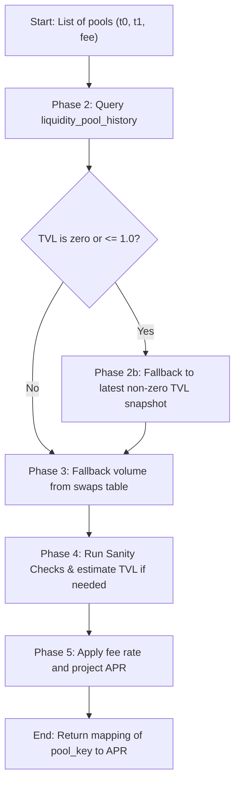

# Pool APR Calculation Specification

This document details the architecture, formulas, and database flow used to calculate and verify historical Annual Percentage Rates (APR) for liquidity pools in the Chaintelligence routing engine.

---

## 1. Overview

Liquidity pool APRs are calculated historically based on trading volumes and liquidity pool snapshots stored in the database. When the user requests a route analysis for a specific date range, the API queries historical pool stats to display the potential yields for each swap segment.

---

## 2. Mathematical Formula

The basic APR calculation is defined as:

$$\text{APR} = \frac{\text{Fees Earned}}{\text{Average TVL}} \times \frac{365}{\text{Days in Range}}$$

Where:
*   $\text{Fees Earned} = \text{Total Volume in USD} \times \text{Fee Rate}$
*   $\text{Average TVL}$ is the time-weighted average Total Value Locked (in USD) over the selected range.
*   $\text{Days in Range}$ is the duration of the analysis window (minimum of 1 day).

---

## 3. Data Retrieval Flow

To maximize performance, pool metrics are queried and computed in **three progressive phases** within the [PostgresFetcher](file:///Users/szabi/git/chaintelligence/chain-feeder/routing/postgres_fetcher.py) class:



### Phase 2: Historical snap queries
Query the `liquidity_pool_history` table for time-weighted average TVL and aggregate trading volume:
```sql
SELECT pool_id,
       SUM(volume_usd) AS total_vol,
       SUM(tvl_usd * n_days) / SUM(n_days) AS avg_tvl
FROM liquidity_pool_history
WHERE pool_id = ANY(%s) AND date >= %s AND date <= %s
GROUP BY pool_id;
```

### Phase 2b: Latest TVL Fallback
For pools with no historical snapshot data in the active range, query the most recent non-zero TVL value across all history (to ensure we do not divide by zero):
```sql
SELECT DISTINCT ON (pool_id) pool_id, ABS(tvl_usd) AS tvl
FROM liquidity_pool_history
WHERE pool_id = ANY(%s) AND tvl_usd <> 0
ORDER BY pool_id, date DESC;
```

### Phase 3: Transaction Swap Volume Fallback
If the historical volume in Phase 2 is zero (due to lagging scraper ingestion), query the raw `swaps` transaction table to get exact swap amounts for the target networks and date range:
```sql
SELECT SUM(s.amount_usd)
FROM swaps s
JOIN coin c0 ON s.t0_coin_id = c0.coin_id
JOIN coin c1 ON s.t1_coin_id = c1.coin_id
WHERE s.ts >= %s AND s.ts <= %s AND s.network = %s AND s.protocol = %s
  AND ((c0.symbol = %s AND c1.symbol = %s) OR (c0.symbol = %s AND c1.symbol = %s))
  AND s.fee_display = %s;
```

---

## 4. Fee Rate Normalization

Pool fees are configured dynamically and normalized into decimal multipliers:
*   **Basis Points (Bips)**: Hardcoded numeric fee tiers (e.g. `100` = `0.01%`, `500` = `0.05%`, `3000` = `0.30%`, `10000` = `1.00%`).
*   **Percentage String**: Clean percent values (e.g. `'0.3%'` = `0.003`).
*   **Dynamic Pools**: Dynamic fees are given a conservative fallback multiplier of `0.0002` (`0.02%`).

---

## 5. TVL Sanity Checks & Fallback Rules

> [!WARNING]
> In testing environments or newly initialized pools, TVL can occasionally be recorded as extremely small (e.g. `$10` or `$480`) while swap volume is high. Dividing by these values results in unrealistically high, exploding APRs (e.g., $>100,000\%$).

To prevent this, the engine enforces a **TVL Sanity Check**:
An observed TVL is marked as **unreliable** if:
1.  Average TVL is `<= $1.0`.
2.  Average TVL is less than **5% of the average daily volume** in the range:
    $$\text{TVL} < \left(\frac{\text{Total Volume}}{\text{Days}}\right) \times 0.05$$

When flagged, the engine **bypasses the APR calculation completely and returns `None`**. In the routing UI, this is displayed as a dash (`-`) or `N/A`. This ensures that routes with missing or corrupted TVL data do not show misleading or exaggerated yield percentages.
